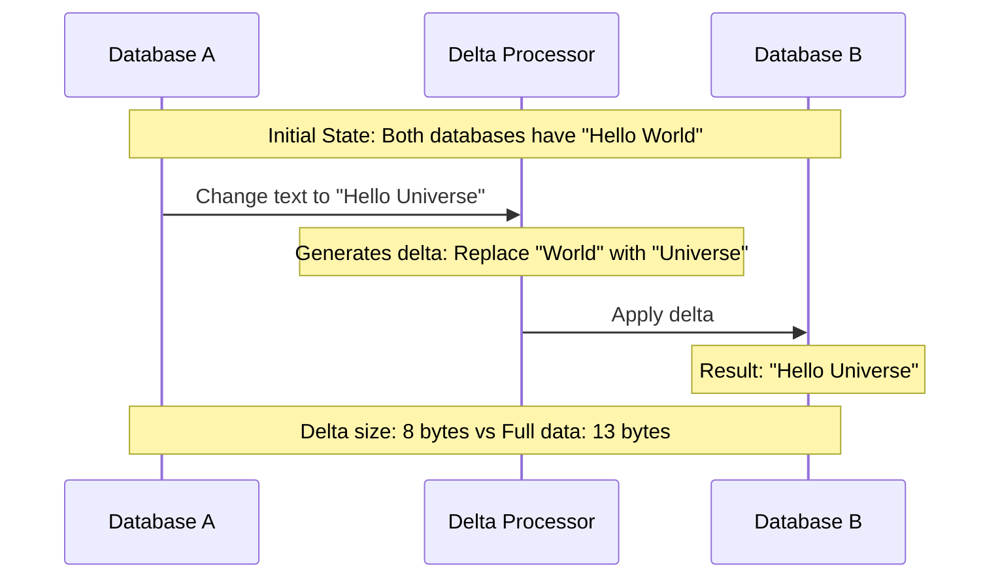
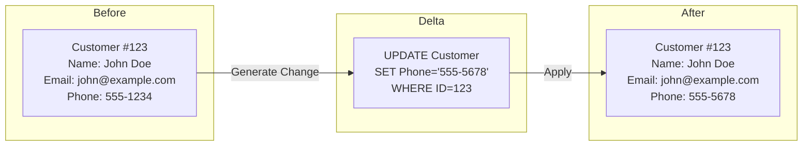
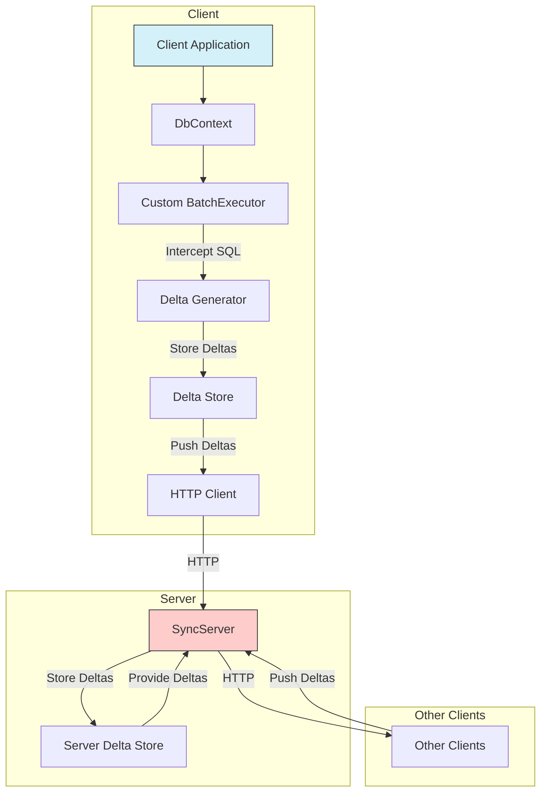

# SyncFramework

A powerful C# library that helps you synchronize any type of data between databases using [delta encoding technology](https://en.wikipedia.org/wiki/Delta_encoding).

## Delta Encoding Theory

Delta encoding is an efficient way to represent data changes by storing only the differences (deltas) between sequential data states rather than complete copies.



### Example

When a user updates a customer record to change just the phone number:



Instead of transmitting the entire record state (potentially hundreds of bytes), SyncFramework only sends the specific SQL command or change instruction needed to update the record (typically less than 50 bytes).

## Available Implementations

SyncFramework currently offers two implementations:

- SyncFramework for XPO
- SyncFramework for Entity Framework Core

## How It Works

SyncFramework uses a delta-based synchronization approach to efficiently synchronize data between databases.



### In a Nutshell

Data synchronization in EFCore is accomplished by replacing the DbContext's internal service collection with a custom one, containing the SyncFramework services.

The SyncFramework services are registered in the service collection using the extension method, `AddEfSynchronization`.

SyncFramework replaces the BatchExecutor service with a custom one, capable of intercepting the generation of SQL commands (Deltas), and storing them so they can be executed in a remote database.

Deltas are typically generated for the same database engine in use, but they can also be generated for a different database. For instance, your main database could be MS SQL Server, but your remote database could be PostgreSQL.

## Documentation

### Blog Series

To learn more about data synchronization concepts and implementation details, check out the following blog posts:

1. [Data Synchronization in a Few Words](https://www.jocheojeda.com/2021/10/10/data-synchronization-in-a-few-words/)
2. [Parts of a Synchronization Framework](https://www.jocheojeda.com/2021/10/10/parts-of-a-synchronization-framework/)
3. [Let's Write a Synchronization Framework in C#](https://www.jocheojeda.com/2021/10/11/lets-write-a-synchronization-framework-in-c/)
4. [Synchronization Framework Base Classes](https://www.jocheojeda.com/2021/10/12/synchronization-framework-base-classes/)
5. [Planning the First Implementation](https://www.jocheojeda.com/2021/10/12/planning-the-first-implementation/)
6. [Testing the First Implementation (Video)](https://youtu.be/l2-yPlExSrg)
7. [Adding Network Support](https://www.jocheojeda.com/2021/10/17/syncframework-adding-network-support/)

### Additional Resources

- [Database Testing Documentation](Tests/BIT.Data.Sync.EfCore.Tests/AllDatatabaseTests.MD) - Details on all database tests
- [API Reference](https://syncframework.jocheojeda.com/api/) - Full API documentation
- [Sample Projects](https://github.com/examples) - Example implementations

## Current Version 7.0.X

**Target Framework:** .NET 6.0

| Component    | Version |
| ------------ | ------- |
| EfCore       | 7.0.3   |
| PostgreSQL   | 7.0.3   |
| Pomelo MySQL | 7.0.0   |
| SQLite       | 7.0.3   |
| SQL Server   | 7.0.3   |

## NuGet Packages

| Package                           | Description                          | Link                                                                                                                                                |
| --------------------------------- | ------------------------------------ | --------------------------------------------------------------------------------------------------------------------------------------------------- |
| BIT.Data.Sync                     | Common base classes and interfaces   | [](https://www.nuget.org/packages/BIT.Data.Sync/)                                         |
| BIT.Data.Sync.EfCore              | Core Entity Framework implementation | [](https://www.nuget.org/packages/BIT.Data.Sync.EfCore/)                           |
| BIT.Data.Sync.EfCore.Npgsql       | PostgreSQL support                   | [](https://www.nuget.org/packages/BIT.Data.Sync.EfCore.Npgsql/)             |
| BIT.Data.Sync.EfCore.Pomelo.MySql | MySQL/MariaDB support via Pomelo     | [](https://www.nuget.org/packages/BIT.Data.Sync.EfCore.Pomelo.MySql/) |
| BIT.Data.Sync.EfCore.Sqlite       | SQLite support                       | [](https://www.nuget.org/packages/BIT.Data.Sync.EfCore.Sqlite/)             |
| BIT.Data.Sync.EfCore.SqlServer    | SQL Server support                   | [](https://www.nuget.org/packages/BIT.Data.Sync.EfCore.SqlServer/)       |

## Playground

Check out our interactive playground demo:

[SyncFramework Playground](https://syncframework.jocheojeda.com/)

## Getting started

The first step is to install the Nuget package that matches your current database, for example if you are using
MsSqlServer you should install the following Nuget package

BIT.Data.Sync.EfCore.SqlServer

If you want to use the SyncFramework with a different database engine, you should install the corresponding Nuget package.

Let's prepare the services needed for database synchronization

### Service collection

```csharp

//The options needed for the DbContext, you can build them in any way you want, in this case we are using Sqlite
DbContextOptionsBuilder OptionsBuilder = new DbContextOptionsBuilder();
OptionsBuilder.UseSqlite(ConnectionString);

//The http client is used to send the deltas to the server
 HttpClient Client = new HttpClient();
 Client.BaseAddress = new Uri("https://ReplaceWithYourServerUrl/");

 //The DeltaGenerator is used to generate the deltas, you can add as many as you want, in this case we are using the Sqlite and SqlServer generators
 List<DeltaGeneratorBase> DeltaGenerators = new List<DeltaGeneratorBase>();
 DeltaGenerators.Add(new SqliteDeltaGenerator());
 DeltaGenerators.Add(new SqlServerDeltaGenerator());
 DeltaGeneratorBase[] additionalDeltaGenerators = DeltaGenerators.ToArray();

//We prepare the service collection that will be used to register the SyncFramework services
ServiceCollection ServiceCollection = new ServiceCollection();
ServiceCollection.AddEfSynchronization((options) =>
{
    string ConnectionString $"Data Source=Deltas.db;";
    //The EfSynchronizationOptions is used to configure the database synchronization
    options.UseSqlite(ConnectionString);// we are going to store the deltas in a Sqlite database
    //it's possible to store deltas any any of the supported database engines, for example you could use MsSqlServer
    //options.UseSqlServer(ConnectionString);
},
//The http client that will send the data to the server
Client,
//the ID of the delta store on the server side,a sync server can have multiple delta stores
"MemoryDeltaStore1",
//the ID of this client, each client has to have an unique id
Maui",
//Additional delta generators, in this case we are using the Sqlite and SqlServer generators
additionalDeltaGenerators);

//We add the entity framework services, in this case we are using Sqlite
ServiceCollection.AddEntityFrameworkSqlite();

//We build the service provider
var ServiceProvider = ServiceCollection.BuildServiceProvider();
```

### The DbContext

You should use SyncFrameworkDbContext instead of the regular DbContext. SyncFrameworkDbContext is a subclass of the regular DbContext. The only difference is that it implements all the boilerplate code needed for synchronization, so you can use it in the same way.

```csharp

MyDbContext MyDbContext = new MyDbContext(OptionsBuilder.Options, ServiceProvider);
MyDbContext.Database.EnsureCreated();

```

If you don't want to use SyncFrameworkDbContext you can extend your own DbContext by implementing ISyncClientNode interface.

```csharp

public class MyAppDbContext : DbContext, ISyncClientNode

```

Then, you need to create a new instance of the delta processor and the services provider that we built in previous steps. Let's do that in the constructor of your DbContext.

```csharp

public MyAppDbContext(DbContextOptions options,IServiceProvider serviceProvider) : base(options)
{
    this.serviceProvider = serviceProvider;
    this.DeltaProcessor = new EFDeltaProcessor(this);
}

```

Then we need to replaces the service provider with our own, let's do that by override or extend the configuration method as follows

```csharp
protected override void OnConfiguring(DbContextOptionsBuilder optionsBuilder)
{
    this.Identity = serviceProvider.GetService<ISyncIdentityService>()?.Identity;
    this.DeltaStore = serviceProvider.GetService<IDeltaStore>();
    this.SyncFrameworkClient = serviceProvider.GetService<ISyncFrameworkClient>();
    optionsBuilder.UseInternalServiceProvider(serviceProvider);
}
```

Our DbContext is able to store and process deltas and push and pull deltas from a SyncServer.

We are done!!!

### Fetching pulling and pushing deltas

The operations of fetch, pull and push are generic and they are implemented as extension methods of in the ISyncClientNode interface.

- Fetch:Fetches the deltas from the server and returns them as a list of Delta objects
- Pull: Fetches the deltas from the server, process them by execute the sql operations in your local database
- Push: Pushes the deltas to the server

```csharp

await MyDbContext.PushAsync();

await MyDbContext.PullAsync();

await MyDbContext.FetchAsync();

```

### Best practices using your DbConext to push and pull deltas

You should use your DbContext withing a using statement, this will ensure that the DbContext is disposed and the connection is closed, also that the http client is not dissposed (this can happend in platforms like MAUI).

```csharp
using (var context = GetDbContext())
{
  // use your conext here
}
```

### Implementing a SyncServer

The easiest way to implement a server is to add register a instace of SyncServer in the service collection.

```csharp

public void ConfigureServices(IServiceCollection services)
{
    SyncServerNode syncServerNode = new SyncServerNode(new MemoryDeltaStore(), null, "MemoryDeltaStore1");
    services.AddSingleton<ISyncServer>(new BIT.Data.Sync.Server.SyncServer(syncServerNode));
}

```

and use that service in your controller

```csharp

public class SyncController : ControllerBase
{


    private readonly ILogger<SyncController> _logger;
    private readonly ISyncServer _SyncServer;
    protected string GetHeader(string HeaderName)
    {
        Microsoft.Extensions.Primitives.StringValues stringValues = HttpContext.Request.Headers[HeaderName];
        return stringValues;
    }


    public SyncController(ILogger<SyncController> logger, ISyncServer SyncServer)
    {
        _logger = logger;
        _SyncServer = SyncServer;
    }
    [HttpPost(nameof(Push))]
    public virtual async Task Push()
    {

        string NodeId = GetHeader("NodeId");
        var stream = new StreamReader(this.Request.Body);
        var body = await stream.ReadToEndAsync();
        if (string.IsNullOrEmpty(body))
        return;
        using (var ms = new MemoryStream(Encoding.Unicode.GetBytes(body)))
        {

            DataContractJsonSerializer deserializer = new DataContractJsonSerializer(typeof(List<Delta>));
            List<Delta> Deltas = (List<Delta>)deserializer.ReadObject(ms);
            await _SyncServer.SaveDeltasAsync(NodeId, Deltas, new CancellationToken());
            var Message = $"Push to node:{NodeId}{Environment.NewLine}Deltas Received:{Deltas.Count}{Environment.NewLine}Identity:{Deltas.FirstOrDefault()?.Identity}";
            _logger.LogInformation(Message);
            Debug.WriteLine(Message);

        }
    }
    [HttpGet("Fetch")]
    public async Task<string> Fetch(Guid startindex, string identity = null)
    {
        string NodeId = GetHeader("NodeId");
        var Message = $"Fetch from node:{NodeId}{Environment.NewLine}Start delta index:{startindex}{Environment.NewLine}Client identity:{identity}";
        _logger.LogInformation(Message);
        Debug.WriteLine(Message);
        IEnumerable<IDelta> enumerable;
        if (string.IsNullOrEmpty(identity))
            enumerable = await _SyncServer.GetDeltasAsync(NodeId, startindex, new CancellationToken());
        else
            enumerable = await _SyncServer.GetDeltasFromOtherNodes(NodeId, startindex, identity, new CancellationToken());
        List<Delta> toserialzie = new List<Delta>();
        var knowTypes = new List<Type>() { typeof(DateTimeOffset) };

        foreach (IDelta delta in enumerable)
        {
            toserialzie.Add(new Delta(delta));
        }
        DataContractJsonSerializer js = new DataContractJsonSerializer(typeof(List<Delta>), knowTypes);
        MemoryStream msObj = new MemoryStream();
        js.WriteObject(msObj, toserialzie);
        msObj.Position = 0;
        StreamReader sr = new StreamReader(msObj);
        string jsonDeltas = sr.ReadToEnd();
        return jsonDeltas;

    }

}
```

### Installing project templates

```

dotnet new -i BIT.Data.Sync.Templates

```

### To create a new SyncServer

```

dotnet new SyncServer -o MySyncServer

```

We welcome contributions! Please see our [Contributing Guidelines](CONTRIBUTING.md) for details.

## Changelog

You can see the current list of changes [here](Changes.md)
