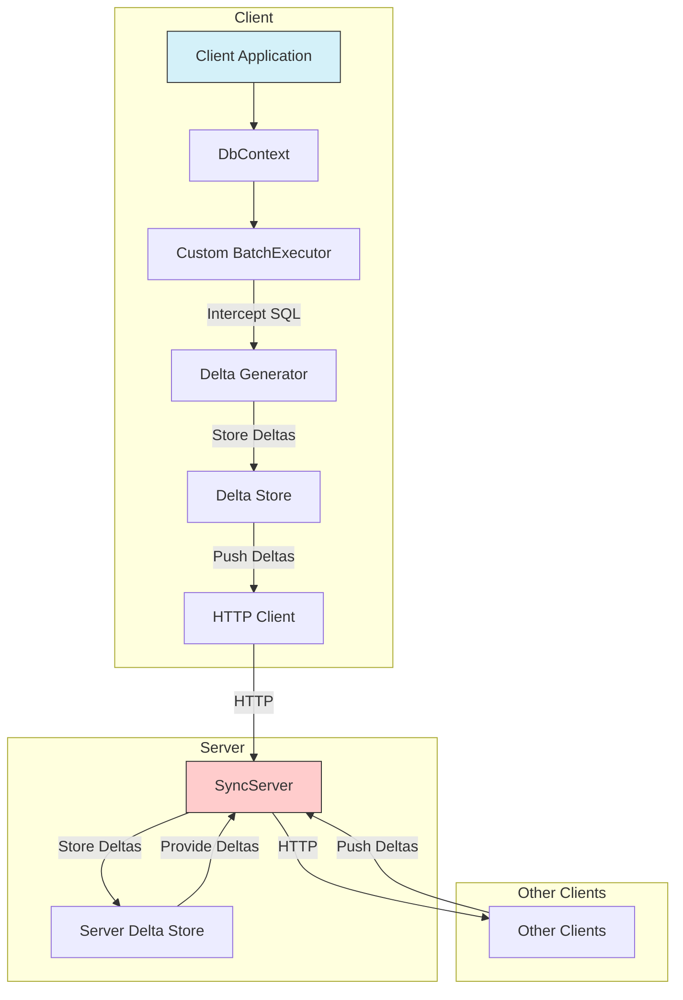
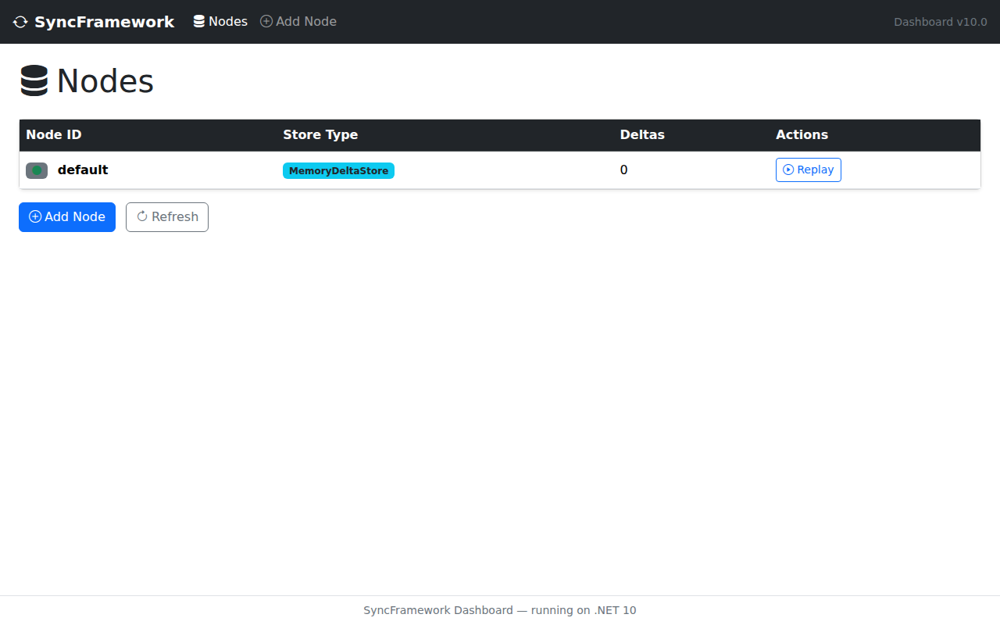
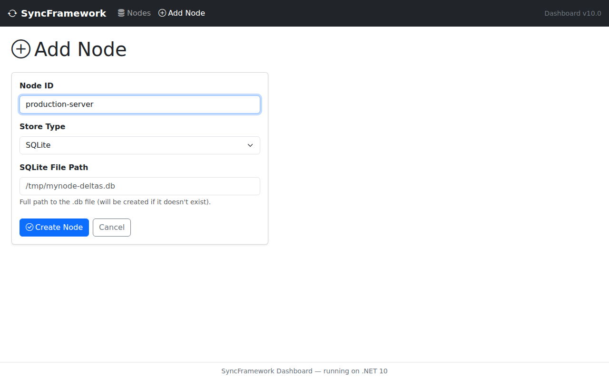
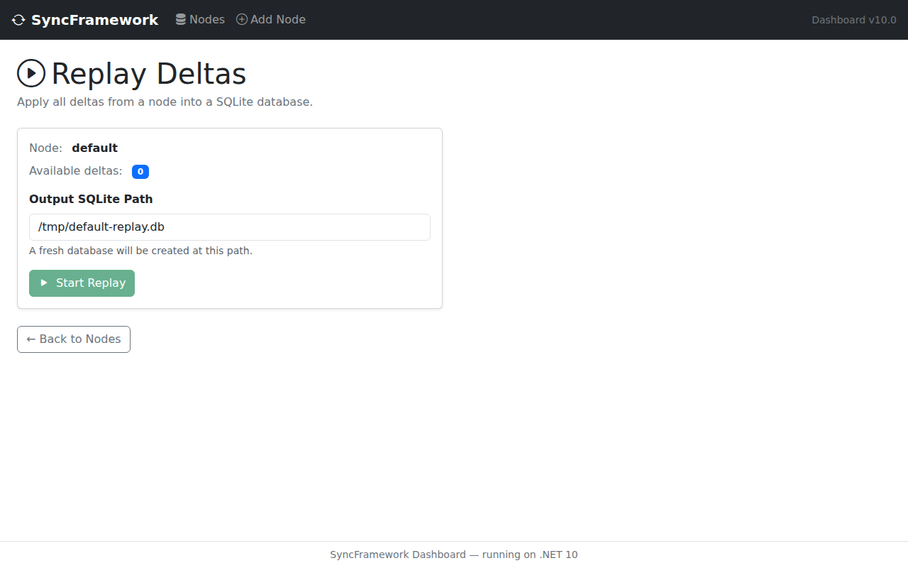

# SyncFramework

A C# library for synchronizing data between databases using [delta encoding](https://en.wikipedia.org/wiki/Delta_encoding).

## Current Version: 10.0.0

**Target Framework:** .NET 10.0

| Component       | Version  |
|-----------------|----------|
| EF Core         | 10.0.0   |
| PostgreSQL      | 10.0.0   |
| MySQL (Oracle)  | 10.0.1   |
| SQLite          | 10.0.0   |
| SQL Server      | 10.0.0   |

---

## How It Works

SyncFramework uses delta-based synchronization to efficiently sync data between databases.


```mermaid
graph TB
    subgraph "Client"
        A[Client Application] --> B[DbContext]
        B --> C[Custom BatchExecutor]
        C -->|Intercept SQL| D[Delta Generator]
        D -->|Store Deltas| E[Delta Store]
        E -->|Push Deltas| F[HTTP Client]
    end
    subgraph "Server"
        F -->|HTTP| G[SyncServer]
        G -->|Store Deltas| H[Server Delta Store]
        H -->|Provide Deltas| G
    end
    subgraph "Other Clients"
        G -->|HTTP| I[Other Clients]
        I -->|Push Deltas| G
    end
    style A fill:#d4f1f9,stroke:#333
    style G fill:#ffcccc,stroke:#333
```

SyncFramework replaces EF Core's internal `BatchExecutor` with a custom one that intercepts generated SQL commands (deltas), stores them, and makes them available for replay on remote databases — even across different database engines.

---

## NuGet Packages

| Package | Description | Link |
|---|---|---|
| `BIT.Data.Sync` | Core interfaces and base classes | [](https://www.nuget.org/packages/BIT.Data.Sync/) |
| `BIT.Data.Sync.EfCore` | EF Core implementation | [](https://www.nuget.org/packages/BIT.Data.Sync.EfCore/) |
| `BIT.Data.Sync.EfCore.Npgsql` | PostgreSQL support | [](https://www.nuget.org/packages/BIT.Data.Sync.EfCore.Npgsql/) |
| `BIT.Data.Sync.EfCore.MySql` | MySQL support (official Oracle driver) | [](https://www.nuget.org/packages/BIT.Data.Sync.EfCore.MySql/) |
| `BIT.Data.Sync.EfCore.Sqlite` | SQLite support | [](https://www.nuget.org/packages/BIT.Data.Sync.EfCore.Sqlite/) |
| `BIT.Data.Sync.EfCore.SqlServer` | SQL Server support | [](https://www.nuget.org/packages/BIT.Data.Sync.EfCore.SqlServer/) |

---

## Getting Started

### 1. Install the package for your database

```bash
dotnet add package BIT.Data.Sync.EfCore.SqlServer   # SQL Server
dotnet add package BIT.Data.Sync.EfCore.Sqlite       # SQLite
dotnet add package BIT.Data.Sync.EfCore.Npgsql       # PostgreSQL
dotnet add package BIT.Data.Sync.EfCore.MySql        # MySQL (Oracle)
```

### 2. Register services

```csharp
var services = new ServiceCollection();
var httpClient = new HttpClient { BaseAddress = new Uri("https://your-sync-server/") };

services.AddSyncFrameworkForSQLite(
    connectionString: "Data Source=deltas.db;",
    httpClient: httpClient,
    serverNodeId: "MemoryDeltaStore1",
    identity: "my-client-id",
    new SqliteDeltaGenerator(),
    new SqlServerDeltaGenerator()
);

var serviceProvider = services.BuildServiceProvider();
```

### 3. Use `SyncFrameworkDbContext`

```csharp
var options = new DbContextOptionsBuilder().UseSqlite("Data Source=myapp.db;").Options;
var ctx = new MyDbContext(options, serviceProvider);
await ctx.Database.EnsureCreatedAsync();
```

### 4. Push, Pull, Fetch

```csharp
await ctx.PushAsync();   // send local deltas to server
await ctx.PullAsync();   // fetch + apply server deltas locally
await ctx.FetchAsync();  // fetch deltas without applying
```

### 5. Implement a SyncServer

```csharp
// Program.cs / Startup.cs
services.AddSyncServerWithMemoryNode("MemoryDeltaStore1");
```

```csharp
// SyncController.cs
[ApiController]
[Route("sync")]
public class SyncController : SyncControllerBase
{
    public SyncController(ILogger<SyncControllerBase> logger, ISyncFrameworkServer server)
        : base(logger, server) { }
}
```

---

## Dashboard

`src/Tools/SyncFramework.Dashboard` is a Blazor Server admin UI for managing sync server nodes.

```bash
cd src/Tools/SyncFramework.Dashboard
ASPNETCORE_ENVIRONMENT=Development dotnet run
# Open http://localhost:5000
```

| Page | Route | Description |
|---|---|---|
| Nodes | `/` | View all active nodes and delta counts |
| Add Node | `/nodes/add` | Spin up a new node (Memory or SQLite) |
| Replay | `/nodes/{id}/replay` | Replay a node's deltas into a SQLite file |

### Screenshots

**Nodes — overview of all active sync nodes**


**Add Node — spin up a new node with store type selection**


**Replay — apply a node's deltas into a local SQLite file**


---

## Documentation

### Blog Series
1. [Data Synchronization in a Few Words](https://www.jocheojeda.com/2021/10/10/data-synchronization-in-a-few-words/)
2. [Parts of a Synchronization Framework](https://www.jocheojeda.com/2021/10/10/parts-of-a-synchronization-framework/)
3. [Let's Write a Synchronization Framework in C#](https://www.jocheojeda.com/2021/10/11/lets-write-a-synchronization-framework-in-c/)
4. [Synchronization Framework Base Classes](https://www.jocheojeda.com/2021/10/12/synchronization-framework-base-classes/)
5. [Planning the First Implementation](https://www.jocheojeda.com/2021/10/12/planning-the-first-implementation/)
6. [Testing the First Implementation (Video)](https://youtu.be/l2-yPlExSrg)
7. [Adding Network Support](https://www.jocheojeda.com/2021/10/17/syncframework-adding-network-support/)

### Additional Resources
- [Database Testing Documentation](src/Tests/BIT.Data.Sync.EfCore.Tests/AllDatabaseTests.md)
- [API Reference](https://syncframework.jocheojeda.com/api/)
- [Playground](https://syncframework.jocheojeda.com/)

---

## Changelog

All notable changes are documented in **[CHANGELOG.md](./CHANGELOG.md)**, following the [Keep a Changelog](https://keepachangelog.com/en/1.0.0/) format.

### Contributing to the changelog

When opening a PR or making a commit that changes behavior:

1. Add an entry under the `[Unreleased]` section at the top of `CHANGELOG.md`
2. Use the appropriate category:
   - **Added** — new features
   - **Changed** — changes to existing behavior
   - **Deprecated** — soon-to-be removed features
   - **Removed** — removed features
   - **Fixed** — bug fixes
   - **Security** — vulnerability fixes
   - **Breaking Changes** — changes that break backward compatibility
3. On release, rename `[Unreleased]` to the version number and date, e.g. `[10.1.0] — 2026-05-01`

**Example entry:**
```markdown
## [Unreleased]

### Added
- `IDeltaStore.PurgeAsync` — bulk delete deltas older than a given date

### Fixed
- Replay page now handles empty delta stores without crashing
```

---

## Project Templates

```bash
dotnet new install BIT.Data.Sync.Templates
dotnet new SyncServer -o MySyncServer
```
