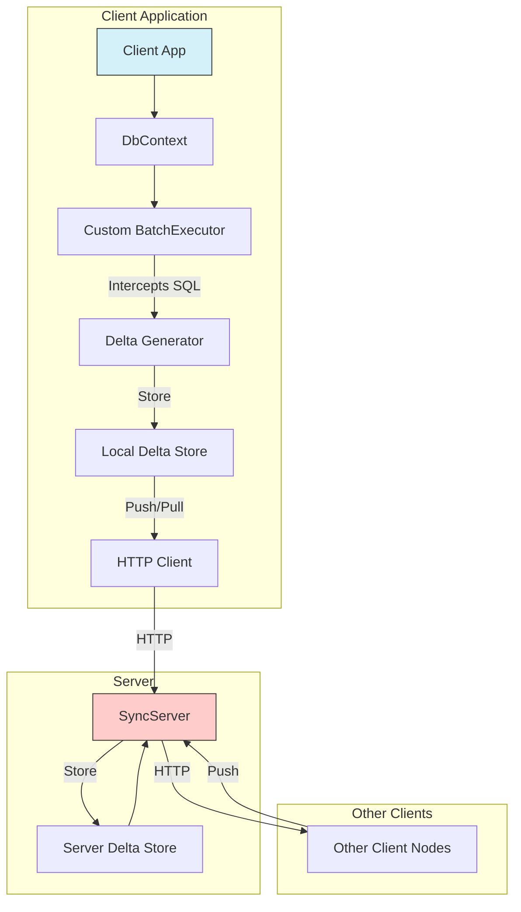
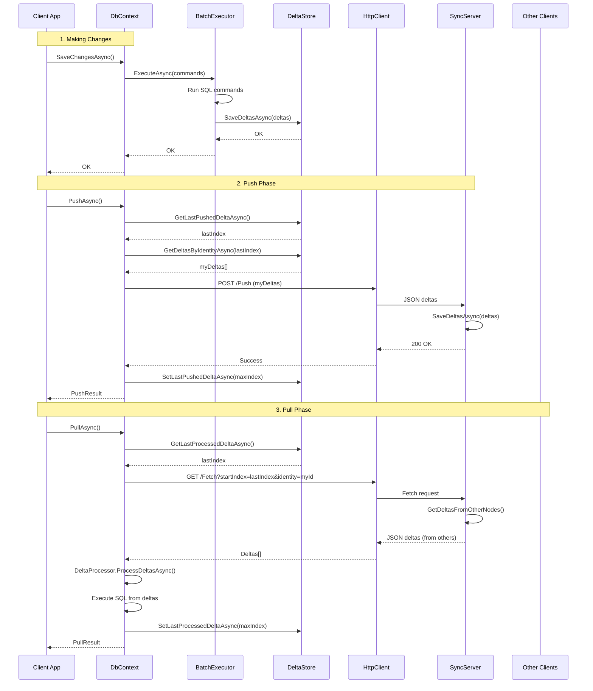

# SyncFramework — Complete Guide

## Overview

SyncFramework is a powerful C# library that enables efficient data synchronization between databases using delta encoding technology. Instead of transmitting complete database records, SyncFramework captures only the changes (deltas) as SQL commands and synchronizes them across distributed databases. This dramatically reduces bandwidth usage and improves synchronization performance.

**What you will achieve after this guide:**
- Understand how delta-based synchronization works in SyncFramework
- Set up both client and server nodes for database synchronization
- Integrate SyncFramework with Entity Framework Core applications
- Implement bidirectional data synchronization between multiple databases
- Extend the framework to support additional database engines

**Architecture Overview:**



**How it works:**
1. SyncFramework replaces EF Core's internal `BatchExecutor` with a custom implementation
2. When SaveChanges() is called, the custom executor intercepts SQL commands before execution
3. SQL commands are serialized as "deltas" and stored in a local delta store
4. Deltas are pushed to a central server and pulled from it to synchronize with other clients
5. Each client can process deltas from other clients to replicate their database changes

## Prerequisites

### Required Tools and Versions

- **.NET SDK 10.0** or higher (Current version targets `net10.0`)
- **Visual Studio 2022** (17.0+) or **JetBrains Rider** (2023.1+) or **VS Code** with C# extension
- **Entity Framework Core 10.0** (dependencies are automatically managed)
- **NuGet Package Manager** (integrated with Visual Studio/Rider/VS Code)

### Database Requirements

At least one of the following database systems:
- **SQL Server** 2019+ (Microsoft.Data.SqlClient)
- **PostgreSQL** 12+ (Npgsql provider)
- **MySQL** 8.0+ or **MariaDB** 10.5+ (Pomelo.EntityFrameworkCore.MySql)
- **SQLite** 3.35+ (Microsoft.Data.Sqlite)

### Required Background Knowledge

- **C# and .NET**: Intermediate level, understanding of async/await, dependency injection
- **Entity Framework Core**: Working knowledge of DbContext, migrations, and change tracking
- **HTTP/REST APIs**: Basic understanding for client-server communication
- **Database Concepts**: Understanding of CRUD operations, transactions, connection strings

### System Requirements

- **Operating System**: Windows 10+, macOS 11+, or Linux (any modern distro)
- **Memory**: 4GB RAM minimum, 8GB recommended
- **Disk Space**: 500MB for dependencies and development

## Quick Start

### 1. Clone the Repository

```powershell
git clone https://github.com/egarim/SyncFramework.git
cd SyncFramework
```

### 2. Build the Solution

```powershell
cd src
dotnet build All.sln
```

### 3. Run the Playground Sample

The playground demonstrates a working Blazor WebAssembly application with SQLite synchronization:

```powershell
cd SyncFramework.Playground
dotnet run
```

Navigate to `http://localhost:5000` to see the interactive demo with multiple synchronized client nodes.

### 4. Install NuGet Packages for Your Project

For a new project, install the appropriate database-specific package:

**SQL Server:**
```powershell
dotnet add package BIT.Data.Sync.EfCore.SqlServer --version 10.0.0
```

**PostgreSQL:**
```powershell
dotnet add package BIT.Data.Sync.EfCore.Npgsql --version 10.0.0
```

**MySQL/MariaDB (Pomelo):**
```powershell
dotnet add package BIT.Data.Sync.EfCore.Pomelo.MySql --version 9.0.0
```

**SQLite:**
```powershell
dotnet add package BIT.Data.Sync.EfCore.Sqlite --version 10.0.0
```

### 5. Minimal Client Setup Example

```csharp
using BIT.Data.Sync;
using BIT.Data.Sync.EfCore;
using BIT.EfCore.Sync;
using Microsoft.EntityFrameworkCore;
using Microsoft.Extensions.DependencyInjection;

// 1. Create a service collection
var services = new ServiceCollection();

// 2. Configure HTTP client for server communication
var httpClient = new HttpClient();
httpClient.BaseAddress = new Uri("https://your-sync-server.com/");

// 3. Add SyncFramework services (example for SQLite)
services.AddSyncFrameworkForSQLite(
    "Data Source=deltas.db",  // Delta store connection string
    httpClient,
    "ServerNode1",            // Server node ID
    "ClientA",                // This client's unique identity
    new SqliteDeltaGenerator(), new SqlServerDeltaGenerator() // Additional generators
);

// 4. Add sequence service
services.AddSingleton<ISequenceService, EfSequenceService>();

// 5. Build service provider
var serviceProvider = services.BuildServiceProvider();

// 6. Create DbContext
var optionsBuilder = new DbContextOptionsBuilder();
optionsBuilder.UseSqlite("Data Source=mydata.db");
var dbContext = new MyDbContext(optionsBuilder.Options, serviceProvider);

// 7. Ensure database is created
await dbContext.Database.EnsureCreatedAsync();

// 8. Use the context normally
dbContext.MyEntities.Add(new MyEntity { Name = "Test" });
await dbContext.SaveChangesAsync(); // This creates a delta

// 9. Push deltas to server
await dbContext.PushAsync();

// 10. Pull deltas from server
await dbContext.PullAsync();
```

### 6. Minimal Server Setup Example

```csharp
using BIT.Data.Sync.AspNetCore.Controllers;
using Microsoft.AspNetCore.Builder;
using Microsoft.Extensions.DependencyInjection;

var builder = WebApplication.CreateBuilder(args);

// Add SyncServer with memory node
builder.Services.AddSyncServerWithMemoryNode("ServerNode1");

// Add controllers
builder.Services.AddControllers();

var app = builder.Build();

app.MapControllers();
app.Run();
```

Create a controller inheriting from `SyncControllerBase`:

```csharp
using BIT.Data.Sync.AspNetCore.Controllers;
using BIT.Data.Sync.Server;
using Microsoft.AspNetCore.Mvc;
using Microsoft.Extensions.Logging;

[ApiController]
[Route("api/[controller]")]
public class SyncController : SyncControllerBase
{
    public SyncController(ILogger<SyncControllerBase> logger, ISyncFrameworkServer syncServer) 
        : base(logger, syncServer)
    {
    }
}
```

## Project Structure

```
SyncFramework/
│
├── README.md                              # Main documentation
├── Changes.md                             # Version history and changes
├── src/
│   ├── All.sln                           # Complete solution file
│   ├── Directory.Build.props             # Shared build properties and version numbers
│   │
│   ├── BIT.Data.Sync/                    # Core library (base classes and interfaces)
│   │   ├── BIT.Data.Sync.csproj         # Targets net10.0
│   │   ├── IDelta.cs                     # Delta entity interface
│   │   ├── Delta.cs                      # Concrete delta implementation (serializable)
│   │   ├── IDeltaStore.cs                # Interface for storing/retrieving deltas
│   │   ├── DeltaStoreBase.cs            # Base implementation with common logic
│   │   ├── IDeltaProcessor.cs            # Interface for processing (executing) deltas
│   │   ├── DeltaProcessorBase.cs        # Base processor with event support
│   │   ├── ISequenceService.cs           # Interface for delta ordering/sequencing
│   │   ├── SequenceServiceBase.cs       # Base sequence implementation
│   │   ├── ISyncIdentityService.cs       # Client identity service interface
│   │   ├── SyncIdentityService.cs       # Client identity implementation
│   │   ├── Client/
│   │   │   ├── IClientSyncDatabase.cs    # Client node interface
│   │   │   ├── ISyncFrameworkClient.cs   # HTTP client interface
│   │   │   ├── SyncFrameworkHttpClient.cs # HTTP implementation
│   │   │   └── ISyncClientNodeExtensions.cs # Push/Pull/Fetch extension methods
│   │   ├── Server/
│   │   │   ├── ISyncFrameworkServer.cs   # Server interface
│   │   │   ├── SyncFrameworkServer.cs   # Server implementation
│   │   │   ├── SyncServerNode.cs        # Individual node in server
│   │   │   └── IServerSyncEndpoint.cs   # Server endpoint interface
│   │   └── Imp/
│   │       └── MemoryDeltaStore.cs      # In-memory delta store (testing)
│   │
│   ├── BIT.Data.Sync.AspNetCore/         # ASP.NET Core integration
│   │   ├── AspNetCoreServiceExtensions.cs # DI extensions for server setup
│   │   └── Controllers/
│   │       └── SyncControllerBase.cs     # Base controller for Push/Fetch endpoints
│   │
│   ├── EntityFrameworkCore/
│   │   ├── BIT.Data.Sync.EfCore/         # Core EF integration
│   │   │   ├── SyncFrameworkDbContext.cs # Base DbContext with sync capabilities
│   │   │   ├── SyncFrameworkBatchExecutor.cs # Custom executor that intercepts SQL
│   │   │   ├── EFDeltaProcessor.cs       # Processes deltas by executing SQL
│   │   │   ├── EFDeltaStore.cs          # EF-based delta storage
│   │   │   ├── DeltaDbContext.cs        # DbContext for delta store
│   │   │   ├── DeltaGeneratorBase.cs    # Base class for DB-specific generators
│   │   │   ├── EfSequenceService.cs     # EF-based sequence service
│   │   │   ├── SyncFrameworkDbContextExtensions.cs # AddEfSynchronization method
│   │   │   └── Data/
│   │   │       ├── ModificationCommandData.cs # Represents intercepted command
│   │   │       └── EfSqlCommandData.cs   # SQL command with parameters
│   │   │
│   │   ├── BIT.Data.Sync.EfCore.SqlServer/ # SQL Server provider
│   │   │   ├── SqlServerDeltaGenerator.cs # Generates SQL Server specific SQL
│   │   │   └── ExtensionSyncFrameworkForSqlServer.cs # AddSyncFrameworkForSqlServer
│   │   │
│   │   ├── BIT.Data.Sync.EfCore.Npgsql/  # PostgreSQL provider
│   │   │   ├── NpgsqlDeltaGenerator.cs
│   │   │   └── ExtensionSyncFrameworkForNpgsql.cs
│   │   │
│   │   ├── BIT.Data.Sync.EfCore.Pomelo.MySql/ # MySQL/MariaDB provider
│   │   │   ├── MySqlDeltaGenerator.cs
│   │   │   └── ExtensionSyncFrameworkForMysql.cs
│   │   │
│   │   └── BIT.Data.Sync.EfCore.Sqlite/  # SQLite provider
│   │       ├── SqliteDeltaGenerator.cs
│   │       └── ExtensionSyncFrameworkForSQLite.cs
│   │
│   ├── SyncFramework.Playground/          # **Blazor WASM demo app** (START HERE)
│   │   ├── Program.cs                    # Entry point
│   │   ├── EfCore/
│   │   │   ├── ContactsDbContext.cs     # Sample DbContext
│   │   │   ├── EfClientNodeInstance.cs  # Client node setup example
│   │   │   ├── Person.cs                # Sample entity
│   │   │   └── PhoneNumber.cs           # Related entity
│   │   └── Pages/                        # Blazor UI pages
│   │
│   ├── Sample/
│   │   └── SyncServer/                   # Sample standalone server
│   │
│   └── Tests/                            # Unit and integration tests
│
└── templates/                            # Project templates (dotnet new)
```

### Files You Will Modify vs. Infrastructure

**You will modify:**
- Your `DbContext` class (inherit from `SyncFrameworkDbContext`)
- Your entity classes
- Client setup code (service registration)
- Server setup code (if hosting your own server)
- Configuration files (connection strings, node IDs)

**You should NOT modify (infrastructure):**
- Core library files in `BIT.Data.Sync/`
- EF Core integration files in `EntityFrameworkCore/`
- Base classes like `SyncFrameworkBatchExecutor`, `DeltaStoreBase`, etc.
- Delta generator implementations

## Core Concepts

### 1. Delta (IDelta / Delta)

**What it is:** A Delta represents a single database change operation (INSERT, UPDATE, DELETE). It's essentially a serialized SQL command with parameters.

**Properties:**
- `DeltaId`: Unique identifier (GUID)
- `Identity`: ID of the client that created this delta (e.g., "ClientA")
- `Index`: Sequential index for ordering (e.g., "202401234567890")
- `Operation`: Byte array containing serialized SQL command and parameters
- `Date`: UTC timestamp of creation
- `Epoch`: Numeric timestamp for additional ordering

**Why it matters:** Deltas are the fundamental unit of synchronization. By transmitting only deltas instead of full records, bandwidth is minimized.

**Where it lives:**
- Interface: [src/BIT.Data.Sync/IDelta.cs](src/BIT.Data.Sync/IDelta.cs) (lines 1-20)
- Implementation: [src/BIT.Data.Sync/Delta.cs](src/BIT.Data.Sync/Delta.cs) (lines 1-95)

**Example:**
```csharp
var delta = new Delta(
    identity: "ClientA",
    operation: Encoding.UTF8.GetBytes("INSERT INTO Persons (Id, Name) VALUES (@p0, @p1)")
);
// Delta.Index is auto-generated by sequence service
// Delta.Date is set to DateTime.UtcNow
```

### 2. Delta Store (IDeltaStore)

**What it is:** A repository that persists deltas. Stores both locally-generated deltas and deltas received from other clients.

**Key responsibilities:**
- Store deltas: `SaveDeltasAsync(IEnumerable<IDelta> deltas)`
- Retrieve deltas: `GetDeltasAsync(string startIndex)` - all deltas after a given index
- Retrieve deltas from others: `GetDeltasFromOtherClients(string startIndex, string myIdentity)`
- Track synchronization state: `GetLastProcessedDeltaAsync()` / `SetLastProcessedDeltaAsync()`
- Track push state: `GetLastPushedDeltaAsync()` / `SetLastPushedDeltaAsync()`

**Why it matters:** The delta store is the local database that tracks all changes. It enables offline operation and reliable synchronization.

**Implementations:**
- **EfDeltaStore**: Uses Entity Framework to persist deltas in a database
  - Location: [src/EntityFrameworkCore/BIT.Data.Sync.EfCore/EFDeltaStore.cs](src/EntityFrameworkCore/BIT.Data.Sync.EfCore/EFDeltaStore.cs)
- **MemoryDeltaStore**: In-memory store for testing
  - Location: [src/BIT.Data.Sync/Imp/MemoryDeltaStore.cs](src/BIT.Data.Sync/Imp/MemoryDeltaStore.cs)

**Configuration:** Delta store connection string is passed to `AddSyncFrameworkFor[Database]()` method.

### 3. Delta Processor (IDeltaProcessor)

**What it is:** Executes deltas by running their SQL commands against the local database.

**Key method:**
- `ProcessDeltasAsync(IEnumerable<IDelta> deltas)`: Deserializes and executes each delta's SQL

**Why it matters:** The processor is responsible for applying remote changes to your local database. It translates deltas back into database operations.

**Implementation:**
- **EfDeltaProcessor**: Executes deltas using ADO.NET
  - Location: [src/EntityFrameworkCore/BIT.Data.Sync.EfCore/EFDeltaProcessor.cs](src/EntityFrameworkCore/BIT.Data.Sync.EfCore/EFDeltaProcessor.cs)
  - See lines 145-210 for the main processing loop

**Example flow:**
1. Delta is deserialized from `byte[]` Operation property
2. SQL command text is extracted for the current database type
3. Parameters are reconstructed from stored metadata
4. ADO.NET command is executed against the database

### 4. Batch Executor (SyncFrameworkBatchExecutor)

**What it is:** A custom EF Core `IBatchExecutor` that intercepts SQL commands before they're executed.

**How it works:**
1. EF Core calls `ExecuteAsync()` with a batch of modification commands
2. Base executor runs the commands normally
3. **After execution**, we intercept and serialize the commands
4. Serialized commands are stored in the delta store

**Why it matters:** This is the "magic" that captures changes without modifying your application code. You call `SaveChanges()` normally, and deltas are created automatically.

**Location:** [src/EntityFrameworkCore/BIT.Data.Sync.EfCore/SyncFrameworkBatchExecutor.cs](src/EntityFrameworkCore/BIT.Data.Sync.EfCore/SyncFrameworkBatchExecutor.cs)

**Key methods:**
- `ExecuteAsync()`: Lines 54-62 - Main interception point
- `SaveDeltasAsync()`: Lines 64-122 - Converts commands to deltas

**Registration:** Registered via `services.AddScoped<IBatchExecutor, SyncFrameworkBatchExecutor>()` in [SyncFrameworkDbContextExtensions.cs](src/EntityFrameworkCore/BIT.Data.Sync.EfCore/SyncFrameworkDbContextExtensions.cs) line 41.

### 5. Delta Generator (DeltaGeneratorBase)

**What it is:** Database-specific strategy for generating SQL commands. Each database (SQL Server, PostgreSQL, etc.) has slightly different SQL syntax.

**Why it matters:** When processing deltas, you need to generate SQL compatible with your **current** database, even if the delta was created on a different database type. Delta generators enable cross-database synchronization.

**Usage pattern:**
```csharp
// Provide generators for all databases you want to support
var generators = new DeltaGeneratorBase[] {
    new SqliteDeltaGenerator(),
    new SqlServerDeltaGenerator(),
    new NpgsqlDeltaGenerator()
};

services.AddSyncFrameworkForSQLite(
    "Data Source=deltas.db",
    httpClient,
    "ServerNode1",
    "ClientA",
    generators  // Pass as params
);
```

**Implementations:**
- SQL Server: [src/EntityFrameworkCore/BIT.Data.Sync.EfCore.SqlServer/SqlServerDeltaGenerator.cs](src/EntityFrameworkCore/BIT.Data.Sync.EfCore.SqlServer/SqlServerDeltaGenerator.cs)
- PostgreSQL: [src/EntityFrameworkCore/BIT.Data.Sync.EfCore.Npgsql/NpgsqlDeltaGenerator.cs](src/EntityFrameworkCore/BIT.Data.Sync.EfCore.Npgsql/NpgsqlDeltaGenerator.cs)
- SQLite: Similar pattern

### 6. Sequence Service (ISequenceService)

**What it is:** Generates monotonically increasing string-based indices for delta ordering.

**Why it matters:** String indices enable lexicographic comparison across distributed systems without requiring a central authority. Example: "202401234567890001" < "202401234567890002".

**Key methods:**
- `GenerateNextSequenceAsync()`: Returns next sequence value
- `GetFirstIndexValue()`: Returns minimum comparable value (e.g., "-1")

**Implementations:**
- **EfSequenceService**: Database-backed sequence
  - Location: [src/EntityFrameworkCore/BIT.Data.Sync.EfCore/EfSequenceService.cs](src/EntityFrameworkCore/BIT.Data.Sync.EfCore/EfSequenceService.cs)
- **MemorySequenceService**: In-memory sequence

**Prefix strategies:** Use `ISequencePrefixStrategy` to add prefixes (e.g., year-based: "2024-001", "2024-002").

**Registration:** Must be explicitly added:
```csharp
services.AddSingleton<ISequenceService, EfSequenceService>();
```

### 7. Sync Client Node (IClientSyncDatabase)

**What it is:** Represents a single client participant in the synchronization network.

**Properties:**
- `Identity`: Unique ID of this client (e.g., "MobileApp1")
- `DeltaStore`: Local delta storage
- `DeltaProcessor`: Processes incoming deltas
- `SyncFrameworkClient`: HTTP client for server communication

**Extension methods (key operations):**
- **`PushAsync()`**: Sends locally-created deltas to server
  - Location: [src/BIT.Data.Sync/Client/ISyncClientNodeExtensions.cs](src/BIT.Data.Sync/Client/ISyncClientNodeExtensions.cs) lines 26-53
  - Gets deltas created since last push
  - Sends them via HTTP client
  - Updates last pushed index on success

- **`PullAsync()`**: Fetches and applies deltas from server
  - Location: [src/BIT.Data.Sync/Client/ISyncClientNodeExtensions.cs](src/BIT.Data.Sync/Client/ISyncClientNodeExtensions.cs) lines 19-38
  - Fetches deltas from server
  - Processes them via DeltaProcessor
  - Updates last processed index

- **`FetchAsync()`**: Gets deltas from server without processing them
  - Location: [src/BIT.Data.Sync/Client/ISyncClientNodeExtensions.cs](src/BIT.Data.Sync/Client/ISyncClientNodeExtensions.cs) lines 13-17

**Implementation:** `SyncFrameworkDbContext` implements `IClientSyncDatabase`.

### 8. Sync Server (ISyncFrameworkServer)

**What it is:** Central coordinator that receives deltas from clients and distributes them to other clients.

**Key responsibilities:**
- **`SaveDeltasAsync()`**: Stores deltas pushed by clients
- **`GetDeltasAsync()`**: Returns all deltas after a given index
- **`GetDeltasFromOtherNodes()`**: Returns deltas created by other clients (excludes caller's own deltas)
- **`RegisterNodeAsync()`**: Dynamically adds new server nodes

**Server Node:** Each server has one or more "nodes" (delta stores). Multiple nodes enable partitioning (e.g., by tenant, region).

**Implementation:**
- Server: [src/BIT.Data.Sync/Server/SyncFrameworkServer.cs](src/BIT.Data.Sync/Server/SyncFrameworkServer.cs)
- Node: [src/BIT.Data.Sync/Server/SyncServerNode.cs](src/BIT.Data.Sync/Server/SyncServerNode.cs)

**ASP.NET Core controller:**
- Base controller: [src/BIT.Data.Sync.AspNetCore/Controllers/SyncControllerBase.cs](src/BIT.Data.Sync.AspNetCore/Controllers/SyncControllerBase.cs)
- Endpoints:
  - `POST /Push`: Receives deltas from clients (line 42)
  - `GET /Fetch`: Sends deltas to clients (line 110)
  - `GET /HandShake`: Health check (line 174)

### 9. Sync Identity (ISyncIdentityService)

**What it is:** Provides the unique identity of the current client.

**Why it matters:** Each delta is tagged with the creator's identity. This enables filtering (e.g., "don't send me my own deltas back").

**Usage:**
```csharp
services.AddSingleton<ISyncIdentityService>(
    new SyncIdentityService("ClientA")
);
```

**Location:** [src/BIT.Data.Sync/SyncIdentityService.cs](src/BIT.Data.Sync/SyncIdentityService.cs)

## Step-by-Step Walkthrough

### Component 1: Setting Up a Client Application

**Goal:** Configure a client that can create deltas and sync with a server.

#### 1.1: Install NuGet Package

Choose the package for your database:

```powershell
dotnet add package BIT.Data.Sync.EfCore.SqlServer --version 10.0.0
```

#### 1.2: Create Entity Classes

Define your domain models as regular EF Core entities:

```csharp
public class Person
{
    [Key]
    public Guid Id { get; set; }
    public string FirstName { get; set; }
    public string LastName { get; set; }
    public ICollection<PhoneNumber> PhoneNumbers { get; set; }
}

public class PhoneNumber
{
    [Key]
    public Guid Id { get; set; }
    public string Number { get; set; }
    public Guid PersonId { get; set; }
    public Person Person { get; set; }
}
```

See example: [src/SyncFramework.Playground/EfCore/Person.cs](src/SyncFramework.Playground/EfCore/Person.cs)

#### 1.3: Create DbContext

Inherit from `SyncFrameworkDbContext`:

```csharp
using BIT.EfCore.Sync;
using Microsoft.EntityFrameworkCore;

public class MyDbContext : SyncFrameworkDbContext
{
    public MyDbContext(
        DbContextOptions options, 
        IServiceProvider serviceProvider) 
        : base(options, serviceProvider)
    {
    }

    public DbSet<Person> Persons { get; set; }
    public DbSet<PhoneNumber> PhoneNumbers { get; set; }
}
```

**Important:** The second constructor parameter (`IServiceProvider`) provides access to SyncFramework services. This is automatically wired up by the framework.

See example: [src/SyncFramework.Playground/EfCore/ContactsDbContext.cs](src/SyncFramework.Playground/EfCore/ContactsDbContext.cs)

#### 1.4: Configure Services

Set up dependency injection:

```csharp
var services = new ServiceCollection();

// 1. Configure HTTP client
var httpClient = new HttpClient();
httpClient.BaseAddress = new Uri("https://your-server.com/");

// 2. Add SyncFramework services
services.AddSyncFrameworkForSqlServer(
    deltaStoreConnectionString: "Server=localhost;Database=DeltaStore;Trusted_Connection=true;",
    httpClient: httpClient,
    ServerNodeId: "ServerNode1",  // Must match server configuration
    Identity: "Client1",           // Unique ID for this client
    AdditionalDeltaGenerators: new DeltaGeneratorBase[] {
        new SqliteDeltaGenerator(),
        new NpgsqlDeltaGenerator()
        // Include generators for databases you might sync with
    }
);

// 3. Add sequence service
services.AddSingleton<ISequenceService, EfSequenceService>();

// Optional: Custom sequence prefix strategy
services.AddSingleton<ISequencePrefixStrategy>(new YearSequencePrefixStrategy());

// 4. Build service provider
var serviceProvider services.BuildServiceProvider();
```

**Key parameters:**
- `deltaStoreConnectionString`: Connection to database that stores deltas (can be same as data DB)
- `ServerNodeId`: ID of the server node to communicate with
- `Identity`: Unique identifier for this client (used to tag your deltas)
- `AdditionalDeltaGenerators`: Generators for other databases you want to support

See example: [src/SyncFramework.Playground/EfCore/EfClientNodeInstance.cs](src/SyncFramework.Playground/EfCore/EfClientNodeInstance.cs) lines 80-93

#### 1.5: Create and Use DbContext

```csharp
// Create DbContext options
var optionsBuilder = new DbContextOptionsBuilder();
optionsBuilder.UseSqlServer("Server=localhost;Database=MyApp;Trusted_Connection=true;");

// Instantiate context
var dbContext = new MyDbContext(optionsBuilder.Options, serviceProvider);

// Initialize schema
await dbContext.Database.EnsureCreatedAsync();
// Or use migrations: await dbContext.Database.MigrateAsync();

// Use context normally - deltas are created automatically
dbContext.Persons.Add(new Person { FirstName = "John", LastName = "Doe" });
await dbContext.SaveChangesAsync(); // Creates a delta in the delta store
```

#### 1.6: Synchronize with Server

**Push your changes:**
```csharp
using (var context = GetDbContext())
{
    // Make changes
    context.Persons.Add(new Person { FirstName = "Jane", LastName = "Smith" });
    await context.SaveChangesAsync();

    // Push deltas to server
    var pushResult = await context.PushAsync();
    Console.WriteLine(pushResult.Message); // "Sent X deltas" or "Nothing to send"
}
```

**Pull changes from others:**
```csharp
using (var context = GetDbContext())
{
    // Pull deltas from server
    var pullResult = await context.PullAsync();
    Console.WriteLine(pullResult.Message); // "Received X deltas" or "Nothing to receive"

    // Your database now has changes from other clients
    var allPersons = await context.Persons.ToListAsync();
}
```

**Best practice:** Always use `using` statements to ensure proper disposal and prevent HTTP client issues.

### Component 2: Setting Up a Server

**Goal:** Create a server that receives and distributes deltas.

#### 2.1: Create ASP.NET Core Project

```powershell
dotnet new web -n MySyncServer
cd MySyncServer
dotnet add package BIT.Data.Sync.AspNetCore
```

#### 2.2: Configure Services in Program.cs

```csharp
using BIT.Data.Sync.AspNetCore.Controllers;
using Microsoft.AspNetCore.Builder;
using Microsoft.Extensions.DependencyInjection;

var builder = WebApplication.CreateBuilder(args);

// Option A: Memory-based server (for testing/demos)
builder.Services.AddSyncServerWithMemoryNode("ServerNode1");

// Option B: Database-backed server
/*
var deltaStore = new EfDeltaStore(deltaDbContext);
builder.Services.AddSyncServerWithDeltaStoreNode(
    deltaStore, 
    "ServerNode1"
);
*/

// Option C: Multiple nodes (multi-tenant)
/*
builder.Services.AddSyncServerWithNodes(
    new SyncServerNode(new MemoryDeltaStore(), null, "Tenant1"),
    new SyncServerNode(new MemoryDeltaStore(), null, "Tenant2")
);
*/

// Add controllers
builder.Services.AddControllers();

var app = builder.Build();
app.MapControllers();
app.Run();
```

See examples:
- Extension methods: [src/BIT.Data.Sync.AspNetCore/AspNetCoreServiceExtensions.cs](src/BIT.Data.Sync.AspNetCore/AspNetCoreServiceExtensions.cs)
- Available methods: `AddSyncServerWithMemoryNode`, `AddSyncServerWithDeltaStoreNode`, `AddSyncServerWithNodes`

#### 2.3: Create Controller

```csharp
using BIT.Data.Sync.AspNetCore.Controllers;
using BIT.Data.Sync.Server;
using Microsoft.AspNetCore.Mvc;
using Microsoft.Extensions.Logging;

[ApiController]
[Route("api/[controller]")]
public class SyncController : SyncControllerBase
{
    public SyncController(
        ILogger<SyncControllerBase> logger, 
        ISyncFrameworkServer syncServer) 
        : base(logger, syncServer)
    {
    }

    // Endpoints are inherited:
    // POST api/sync/Push
    // GET api/sync/Fetch?startIndex={index}&identity={clientId}
    // GET api/sync/HandShake
}
```

**Base controller provides:**
- `Push()`: Receives deltas (line 42 of [SyncControllerBase.cs](src/BIT.Data.Sync.AspNetCore/Controllers/SyncControllerBase.cs))
- `Fetch()`: Sends deltas (line 110)
- `HandShake()`: Health check (line 174)

#### 2.4: Configure Client Connection

Clients send a custom `NodeId` header to identify the server node:

```csharp
var httpClient = new HttpClient();
httpClient.BaseAddress = new Uri("https://your-server.com/api/sync/");
httpClient.DefaultRequestHeaders.Add("NodeId", "ServerNode1");
```

This is handled automatically by `SyncFrameworkHttpClient`. See: [src/BIT.Data.Sync/Client/SyncFrameworkHttpClient.cs](src/BIT.Data.Sync/Client/SyncFrameworkHttpClient.cs)

#### 2.5: Run Server

```powershell
dotnet run
```

Server listens on `http://localhost:5000` by default. Configure ports in `appsettings.json` or via command line.

### Component 3: Delta Flow Deep Dive

**Complete synchronization cycle:**



**Step-by-step:**

1. **Local Change:** User modifies data, app calls `SaveChangesAsync()`
   - EF Core generates SQL commands
   - `SyncFrameworkBatchExecutor` executes them
   - Commands are serialized as deltas
   - Deltas stored in local delta store

2. **Push:** App calls `PushAsync()`
   - Get all unsent deltas (those created since last push)
   - Serialize as JSON
   - HTTP POST to server's `/Push` endpoint
   - Server stores deltas
   - Update local "last pushed" pointer

3. **Pull:** App calls `PullAsync()`
   - HTTP GET to server's `/Fetch` endpoint with last processed index
   - Server returns deltas created by *other* clients (filtered by identity)
   - `DeltaProcessor` deserializes and executes SQL
   - Database is updated
   - Update local "last processed" pointer

### Component 4: Cross-Database Synchronization

**Scenario:** SQLite client syncs with SQL Server client via PostgreSQL server.

**Setup:**

**Client A (SQLite):**
```csharp
services.AddSyncFrameworkForSQLite(
    "Data Source=clientA_deltas.db",
    httpClient,
    "ServerNode1",
    "ClientA_SQLite",
    new SqliteDeltaGenerator(),
    new SqlServerDeltaGenerator(),  // Can process SQL Server deltas
    new NpgsqlDeltaGenerator()      // Can process PostgreSQL deltas
);
```

**Client B (SQL Server):**
```csharp
services.AddSyncFrameworkForSqlServer(
    "Server=localhost;Database=ClientB_Deltas;",
    httpClient,
    "ServerNode1",
    "ClientB_SqlServer",
    new SqlServerDeltaGenerator(),
    new SqliteDeltaGenerator(),     // Can process SQLite deltas
    new NpgsqlDeltaGenerator()
);
```

**Server (PostgreSQL):**
```csharp
var optionsBuilder = new DbContextOptionsBuilder<DeltaDbContext>();
optionsBuilder.UseNpgsql("Host=localhost;Database=server_deltas;");
var deltaDbContext = new DeltaDbContext(optionsBuilder.Options);
var deltaStore = new EfDeltaStore(deltaDbContext);

builder.Services.AddSyncServerWithDeltaStoreNode(deltaStore, "ServerNode1");
```

**How it works:**
1. Client A (SQLite) creates a delta with SQLite-specific SQL
2. Delta is pushed to PostgreSQL server
3. Client B (SQL Server) pulls delta
4. Client B's `SqlServerDeltaGenerator` regenerates the command as SQL Server-compatible SQL
5. Command executes on Client B's SQL Server database

**Key insight:** Deltas store commands in *all* supported database formats. The processor selects the appropriate one based on current database type.

See: [src/EntityFrameworkCore/BIT.Data.Sync.EfCore/EFDeltaProcessor.cs](src/EntityFrameworkCore/BIT.Data.Sync.EfCore/EFDeltaProcessor.cs) lines 57-64

```csharp
var CurrentCommand = modificationCommandData.SqlCommandTexts
    .FirstOrDefault(c => c.DbEngine == CommandDbEngine);
```

### Component 5: Offline Operation

SyncFramework supports offline-first scenarios:

**Pattern:**
1. Client operates normally when offline
2. All changes are stored as deltas locally
3. When network becomes available, call `PushAsync()` and `PullAsync()`
4. All offline changes are synchronized

**Example:**
```csharp
public async Task SyncWhenOnline()
{
    if (!IsNetworkAvailable())
    {
        Console.WriteLine("Offline mode - changes stored locally");
        return;
    }

    using (var context = GetDbContext())
    {
        try
        {
            // Push local changes
            var pushResult = await context.PushAsync();
            Console.WriteLine($"Pushed: {pushResult.Message}");

            // Pull remote changes
            var pullResult = await context.PullAsync();
            Console.WriteLine($"Pulled: {pullResult.Message}");
        }
        catch (HttpRequestException ex)
        {
            Console.WriteLine($"Sync failed: {ex.Message}");
            // Deltas remain in local store, will retry next time
        }
    }
}
```

**Conflict resolution:** Currently, SyncFramework uses "last write wins" based on delta index order. Custom conflict resolution can be implemented by:
1. Listening to `ProcessingDelta` event on `IDeltaProcessorWithEvents`
2. Examining the delta before processing
3. Modifying or skipping it based on business rules

See event interfaces: [src/BIT.Data.Sync/IDeltaProcessorWithEvents.cs](src/BIT.Data.Sync/IDeltaProcessorWithEvents.cs)

## Configuration Reference

### Environment Variables / Configuration Settings

While SyncFramework doesn't use traditional `appsettings.json` directly, here are all configuration points:

#### Client Configuration

| Setting | Type | Required | Description | Example |
|---------|------|----------|-------------|---------|
| **Data Connection String** | `string` | Yes | Connection to your application database | `"Server=localhost;Database=MyApp;"` |
| **Delta Store Connection String** | `string` | Yes | Connection to database storing deltas | `"Server=localhost;Database=Deltas;"` |
| **Server Base URL** | `string` | Yes | URL of sync server | `"https://sync.myapp.com/"` |
| **Server Node ID** | `string` | Yes | ID of server node to communicate with | `"ServerNode1"`, `"Tenant_A"` |
| **Client Identity** | `string` | Yes | Unique ID for this client instance | `"MobileApp_User123"`, `"WebClient_01"` |
| **Additional Delta Generators** | `DeltaGeneratorBase[]` | Optional | Generators for cross-database sync | `new SqliteDeltaGenerator()` |
| **Sequence Prefix Strategy** | `ISequencePrefixStrategy` | Optional | Custom prefix for delta indices | `new YearSequencePrefixStrategy()` |

#### Server Configuration

| Setting | Type | Required | Description | Example |
|---------|------|----------|-------------|---------|
| **Node ID** | `string` | Yes | Identifier for this server node | `"ServerNode1"` |
| **Delta Store Type** | `IDeltaStore` | Yes | Storage backend for deltas | `new MemoryDeltaStore()` or `new EfDeltaStore()` |
| **Register Node Function** | `Func<RegisterNodeRequest, IServerSyncEndpoint>` | Optional | Factory for dynamic node creation | Custom factory function |

#### Database Provider Settings

Each database provider package has specific requirements:

**SQL Server (`BIT.Data.Sync.EfCore.SqlServer`):**
- Version: 10.0.0
- EF Core Version: 10.0.0
- Connection String Format: `"Server=myServer;Database=myDB;User Id=myUser;Password=myPass;"`

**PostgreSQL (`BIT.Data.Sync.EfCore.Npgsql`):**
- Version: 10.0.0
- EF Core Version: 10.0.0
- Connection String Format: `"Host=localhost;Database=myDB;Username=myUser;Password=myPass;"`

**MySQL/MariaDB (`BIT.Data.Sync.EfCore.Pomelo.MySql`):**
- Version: 9.0.0
- EF Core Version: 9.0.0
- Connection String Format: `"Server=localhost;Database=myDB;User=myUser;Password=myPass;"`

**SQLite (`BIT.Data.Sync.EfCore.Sqlite`):**
- Version: 10.0.0
- EF Core Version: 10.0.0
- Connection String Format: `"Data Source=mydb.db"` or `"Data Source=:memory:"`

See version numbers in: [src/Directory.Build.props](src/Directory.Build.props) lines 13-27

### HTTP Headers

Clients send custom headers with requests:

| Header | Value | Purpose |
|--------|-------|---------|
| `NodeId` | Server node ID | Identifies which server node to communicate with |

Example: `httpClient.DefaultRequestHeaders.Add("NodeId", "ServerNode1");`

This is automatically handled by `SyncFrameworkHttpClient`.

### Sequence Configuration

Delta indices are generated by `ISequenceService`. Default format:

```
[Prefix][Counter]
Example: 202401234567890001
         |Year |  Epoch  |Seq|
```

To customize, implement `ISequencePrefixStrategy`:

```csharp
public class CustomPrefixStrategy : ISequencePrefixStrategy
{
    public string GetPrefix()
    {
        return $"{DateTime.UtcNow:yyyyMM}-"; // "202401-"
    }
}

services.AddSingleton<ISequencePrefixStrategy>(new CustomPrefixStrategy());
```

See: [src/BIT.Data.Sync/ISequencePrefixStrategy.cs](src/BIT.Data.Sync/ISequencePrefixStrategy.cs)

## Extending the Project

### Adding Support for a New Database Provider

**Goal:** Enable SyncFramework to work with Oracle, MongoDB, or any other database.

**Steps:**

#### 1. Create a New Project

```powershell
dotnet new classlib -n BIT.Data.Sync.EfCore.Oracle
cd BIT.Data.Sync.EfCore.Oracle
dotnet add package Microsoft.EntityFrameworkCore
dotnet add package Oracle.EntityFrameworkCore --version 10.0.0
dotnet add reference ../BIT.Data.Sync.EfCore/BIT.Data.Sync.EfCore.csproj
```

#### 2. Implement Delta Generator

```csharp
using BIT.EfCore.Sync;
using Microsoft.EntityFrameworkCore.Update;
using System;

namespace BIT.Data.Sync.EfCore.Oracle
{
    public class OracleDeltaGenerator : DeltaGeneratorBase
    {
        public override IUpdateSqlGenerator CreateInstance(IServiceProvider serviceProvider)
        {
            // Return Oracle's IUpdateSqlGenerator implementation
            return serviceProvider.GetService(
                typeof(Oracle.EntityFrameworkCore.Update.Internal.OracleUpdateSqlGenerator)
            ) as IUpdateSqlGenerator;
        }
    }
}
```

**Key points:**
- Inherit from `DeltaGeneratorBase`
- Implement `CreateInstance()` to return the database's `IUpdateSqlGenerator`
- The generator's type name acts as the database identifier

See examples:
- SQL Server: [src/EntityFrameworkCore/BIT.Data.Sync.EfCore.SqlServer/SqlServerDeltaGenerator.cs](src/EntityFrameworkCore/BIT.Data.Sync.EfCore.SqlServer/SqlServerDeltaGenerator.cs)
- SQLite: Similar pattern in SQLite project

#### 3. Create Extension Method

```csharp
using BIT.EfCore.Sync;
using Microsoft.EntityFrameworkCore;
using Microsoft.Extensions.DependencyInjection;
using System.Net.Http;

namespace Microsoft.Extensions.DependencyInjection
{
    public static class ExtensionSyncFrameworkForOracle
    {
        public static IServiceCollection AddSyncFrameworkForOracle(
            this IServiceCollection serviceCollection,
            string oracleDeltaStoreConnectionString,
            HttpClient httpClient,
            string ServerNodeId,
            string Identity,
            params DeltaGeneratorBase[] AdditionalDeltaGenerators)
        {
            serviceCollection.AddEfSynchronization(
                (options) => 
                { 
                    options.UseOracle(oracleDeltaStoreConnectionString); 
                },
                httpClient,
                ServerNodeId, 
                Identity,
                AdditionalDeltaGenerators
            );
            
            serviceCollection.AddEntityFrameworkOracle();
            
            return serviceCollection;
        }
    }
}
```

**Pattern:** All database providers follow this structure. See: [src/EntityFrameworkCore/BIT.Data.Sync.EfCore.SqlServer/ExtensionSyncFrameworkForSqlServer.cs](src/EntityFrameworkCore/BIT.Data.Sync.EfCore.SqlServer/ExtensionSyncFrameworkForSqlServer.cs)

#### 4. Update Updater Alias Service

In `SyncFrameworkDbContextExtensions.cs`, add Oracle's updater type:

```csharp
Dictionary<string, string> KnownUpdaters = new Dictionary<string, string>();
KnownUpdaters.Add("Microsoft.EntityFrameworkCore.Sqlite.Update.Internal.SqliteUpdateSqlGenerator", "Sqlite");
KnownUpdaters.Add("Microsoft.EntityFrameworkCore.SqlServer.Update.Internal.SqlServerUpdateSqlGenerator", "SqlServer");
KnownUpdaters.Add("Npgsql.EntityFrameworkCore.PostgreSQL.Update.Internal.NpgsqlUpdateSqlGenerator", "Postgres");
KnownUpdaters.Add("Pomelo.EntityFrameworkCore.MySql.Update.Internal.MySqlUpdateSqlGenerator", "MySqlPomelo");
// Add Oracle:
KnownUpdaters.Add("Oracle.EntityFrameworkCore.Update.Internal.OracleUpdateSqlGenerator", "Oracle");
```

Location: [src/EntityFrameworkCore/BIT.Data.Sync.EfCore/SyncFrameworkDbContextExtensions.cs](src/EntityFrameworkCore/BIT.Data.Sync.EfCore/SyncFrameworkDbContextExtensions.cs) lines 48-53

#### 5. Usage

```csharp
services.AddSyncFrameworkForOracle(
    "User Id=myUser;Password=myPass;Data Source=myOracle;",
    httpClient,
    "ServerNode1",
    "OracleClient1",
    new OracleDeltaGenerator(),
    new SqlServerDeltaGenerator()  // Support SQL Server clients too
);
```

### Adding Custom Conflict Resolution

**Goal:** Implement business-specific conflict handling instead of "last write wins".

**Approach:** Use event-driven processing.

#### 1. Implement Event Handler

```csharp
using BIT.Data.Sync;
using BIT.Data.Sync.EventArgs;

public class ConflictResolver
{
    public void OnProcessingDelta(object sender, ProcessingDeltaEventArgs e)
    {
        // Examine delta before processing
        var delta = e.Delta;
        
        // Example: Skip updates to archived records
        if (IsArchivedRecord(delta))
        {
            e.Cancel = true; // Don't process this delta
            Console.WriteLine($"Skipped delta {delta.Index} - record is archived");
            return;
        }

        // Example: Custom merge logic for conflicts
        if (HasLocalChanges(delta))
        {
            MergeWithLocalChanges(delta);
        }
    }

    private bool IsArchivedRecord(IDelta delta)
    {
        // Deserialize and inspect delta
        // Return true if it modifies an archived record
        return false; // Implement logic
    }

    private bool HasLocalChanges(IDelta delta)
    {
        // Check if local database has conflicting uncommitted changes
        return false; // Implement logic
    }

    private void MergeWithLocalChanges(IDelta delta)
    {
        // Implement custom merge strategy
    }
}
```

#### 2. Attach Event Handler

```csharp
// Get processor as event-enabled interface
if (dbContext.DeltaProcessor is IDeltaProcessorWithEvents processorWithEvents)
{
    var resolver = new ConflictResolver();
    processorWithEvents.ProcessingDelta += resolver.OnProcessingDelta;
}
```

**Event interfaces available:**
- `IDeltaProcessorWithEvents`: [src/BIT.Data.Sync/IDeltaProcessorWithEvents.cs](src/BIT.Data.Sync/IDeltaProcessorWithEvents.cs)
- `IDeltaStoreWithEvents`: [src/BIT.Data.Sync/IDeltaStoreWithEvents.cs](src/BIT.Data.Sync/IDeltaStoreWithEvents.cs)
- `ISyncServerWithEvents`: [src/BIT.Data.Sync/Server/ISyncServerWithEvents.cs](src/BIT.Data.Sync/Server/ISyncServerWithEvents.cs)
- `ISyncServerNodeWithEvents`: [src/BIT.Data.Sync/Server/ISyncServerNodeWithEvents.cs](src/BIT.Data.Sync/Server/ISyncServerNodeWithEvents.cs)

**Event types:**
- `ProcessingDelta`: Before processing a delta (can cancel)
- `ProcessedDelta`: After successfully processing
- `ProcessingDeltaError`: When processing fails
- `SavingDeltas`: Before saving deltas to store
- `SavedDeltas`: After saving deltas

### Adding a New Sync Endpoint (Custom Transport)

**Goal:** Replace HTTP with WebSockets, gRPC, or message queue.

**Approach:** Implement `ISyncFrameworkClient`.

#### 1. Create Custom Client

```csharp
using BIT.Data.Sync;
using BIT.Data.Sync.Client;
using System;
using System.Collections.Generic;
using System.Threading;
using System.Threading.Tasks;

public class WebSocketSyncClient : ISyncFrameworkClient
{
    private readonly WebSocket webSocket;
    private readonly string serverNodeId;

    public WebSocketSyncClient(WebSocket webSocket, string serverNodeId)
    {
        this.webSocket = webSocket;
        this.serverNodeId = serverNodeId;
    }

    public async Task<FetchOperationResponse> FetchAsync(
        string startIndex, 
        string identity, 
        CancellationToken cancellationToken)
    {
        // 1. Send fetch request via WebSocket
        var request = new { Type = "Fetch", StartIndex = startIndex, Identity = identity };
        await SendMessageAsync(request, cancellationToken);

        // 2. Receive response
        var response = await ReceiveMessageAsync<FetchOperationResponse>(cancellationToken);
        return response;
    }

    public async Task<PushOperationResponse> PushAsync(
        IEnumerable<IDelta> deltas, 
        CancellationToken cancellationToken)
    {
        // 1. Serialize deltas
        var deltaList = deltas.Select(d => new Delta(d)).ToList();
        var request = new { Type = "Push", Deltas = deltaList };

        // 2. Send via WebSocket
        await SendMessageAsync(request, cancellationToken);

        // 3. Receive confirmation
        var response = await ReceiveMessageAsync<PushOperationResponse>(cancellationToken);
        return response;
    }

    public async Task<FetchOperationResponse> HandShake(CancellationToken cancellationToken)
    {
        var request = new { Type = "HandShake" };
        await SendMessageAsync(request, cancellationToken);
        return await ReceiveMessageAsync<FetchOperationResponse>(cancellationToken);
    }

    private Task SendMessageAsync(object message, CancellationToken cancellationToken)
    {
        // Implement WebSocket send
        throw new NotImplementedException();
    }

    private Task<T> ReceiveMessageAsync<T>(CancellationToken cancellationToken)
    {
        // Implement WebSocket receive
        throw new NotImplementedException();
    }
}
```

#### 2. Register Custom Client

```csharp
var webSocketClient = new WebSocketSyncClient(myWebSocket, "ServerNode1");

services.AddEfSynchronization(
    (options) => { options.UseSqlite("Data Source=deltas.db"); },
    webSocketClient,  // Use custom client instead of HTTP
    "ClientA",
    new SqliteDeltaGenerator()
);
```

**Reference implementation:** [src/BIT.Data.Sync/Client/SyncFrameworkHttpClient.cs](src/BIT.Data.Sync/Client/SyncFrameworkHttpClient.cs)

### Implementing Multi-Tenant Server

**Goal:** Support multiple isolated sync groups (tenants) on one server.

**Approach:** Use multiple server nodes.

```csharp
// Server setup
var tenant1Store = new EfDeltaStore(tenant1DbContext);
var tenant2Store = new EfDeltaStore(tenant2DbContext);

builder.Services.AddSyncServerWithNodes(
    new SyncServerNode(tenant1Store, null, "Tenant1_Node"),
    new SyncServerNode(tenant2Store, null, "Tenant2_Node")
);
```

**Client configuration:**
```csharp
// Tenant 1 client
services.AddSyncFrameworkForSqlServer(
    connectionString,
    httpClient,
    ServerNodeId: "Tenant1_Node",  // Connect to tenant 1 node
    Identity: "Tenant1_Client1",
    generators
);

// Tenant 2 client
services.AddSyncFrameworkForSqlServer(
    connectionString,
    httpClient,
    ServerNodeId: "Tenant2_Node",  // Connect to tenant 2 node
    Identity: "Tenant2_Client1",
    generators
);
```

**Isolation:** Each tenant's deltas are stored in separate delta stores. No cross-tenant synchronization occurs.

**Dynamic nodes:** Use `RegisterNodeFunction` to create nodes on-demand:

```csharp
builder.Services.AddSyncServer(registerNodeRequest => 
{
    var tenantId = registerNodeRequest.NodeId;
    var deltaStore = CreateDeltaStoreForTenant(tenantId);
    return new SyncServerNode(deltaStore, null, tenantId);
});
```

See: [src/BIT.Data.Sync.AspNetCore/AspNetCoreServiceExtensions.cs](src/BIT.Data.Sync.AspNetCore/AspNetCoreServiceExtensions.cs) lines 62-68

## Troubleshooting

### Common Errors and Solutions

#### Error: "Unable to resolve nonexistent file"

**Symptom:** Build error or runtime `FileNotFoundException`.

**Cause:** Missing project reference or NuGet package.

**Solution:**
```powershell
# Check if package is installed
dotnet list package

# Add missing package
dotnet add package BIT.Data.Sync.EfCore.SqlServer --version 10.0.0

# Restore packages
dotnet restore
```

#### Error: "The delta does not contain information for current database using updater type"

**Symptom:** Exception during `PullAsync()` when processing deltas.

**Cause:** Missing delta generator for your database type.

**Solution:** Add generator when configuring services:

```csharp
services.AddSyncFrameworkForSqlServer(
    connectionString,
    httpClient,
    "ServerNode1",
    "ClientA",
    new SqlServerDeltaGenerator(),
    new SqliteDeltaGenerator(),    // Add generator for source DB
    new NpgsqlDeltaGenerator()     // Add generator for source DB
);
```

See explanation in: [src/EntityFrameworkCore/BIT.Data.Sync.EfCore/EFDeltaProcessor.cs](src/EntityFrameworkCore/BIT.Data.Sync.EfCore/EFDeltaProcessor.cs) lines 57-64

#### Error: "There was a problem creating the database connection using DbProviderFactories.GetFactory"

**Symptom:** Exception when processing deltas.

**Cause:** Database provider factory not registered.

**Solution:** Register the factory in your application startup:

```csharp
// For SQL Server
DbProviderFactories.RegisterFactory(
    "Microsoft.Data.SqlClient", 
    Microsoft.Data.SqlClient.SqlClientFactory.Instance
);

// For Npgsql
DbProviderFactories.RegisterFactory(
    "Npgsql", 
    Npgsql.NpgsqlFactory.Instance
);
```

See: [Microsoft documentation on DbProviderFactories](https://docs.microsoft.com/en-us/dotnet/api/system.data.common.dbproviderfactories.registerfactory)

#### Error: "NodeId header missing" or "NodeNotFoundException"

**Symptom:** HTTP 400/404 error when pushing/pulling.

**Cause:** Client not sending `NodeId` header, or node doesn't exist on server.

**Solution:**

1. Verify client configuration:
```csharp
var httpClient = new HttpClient();
httpClient.BaseAddress = new Uri("https://server.com/api/sync/");
var syncClient = new SyncFrameworkHttpClient(httpClient, "ServerNode1");
// ^ This automatically adds NodeId header
```

2. Verify server has the node:
```csharp
builder.Services.AddSyncServerWithMemoryNode("ServerNode1");
//                                           ^^^^^^^^^^^^^^
//                                           Must match client's ServerNodeId
```

#### Error: "Nothing to receive" but changes are expected

**Symptom:** `PullAsync()` returns "Nothing to receive" but other clients have pushed changes.

**Cause:** Client's `lastProcessedIndex` is ahead of available deltas, or identity filter is blocking own deltas.

**Debugging:**
```csharp
using (var context = GetDbContext())
{
    // Check last processed index
    var lastProcessed = await context.DeltaStore
        .GetLastProcessedDeltaAsync(context.Identity, cancellationToken);
    Console.WriteLine($"Last processed: {lastProcessed}");

    // Check available deltas
    var allDeltas = await context.DeltaStore
        .GetDeltasAsync("-1", cancellationToken);
    Console.WriteLine($"Total deltas in store: {allDeltas.Count()}");

    // Check deltas from others
    var othersDeltas = await context.DeltaStore
        .GetDeltasFromOtherClients("-1", context.Identity, cancellationToken);
    Console.WriteLine($"Deltas from others: {othersDeltas.Count()}");
}
```

**Solution:** If needed, reset synchronization state:
```csharp
await context.DeltaStore.SetLastProcessedDeltaAsync("-1", context.Identity, cancellationToken);
```

⚠️ **Warning:** This will re-process all deltas, which may cause duplicate data.

#### Error: Duplicate key violations during PullAsync()

**Symptom:** `PullAsync()` throws unique constraint violation.

**Cause:** Delta has already been processed, or there's a genuine conflict.

**Solution 1:** Enable identity insert (SQL Server):
```sql
SET IDENTITY_INSERT TableName ON;
-- Process delta
SET IDENTITY_INSERT TableName OFF;
```

**Solution 2:** Implement custom conflict resolution (see "Extending the Project" section).

**Solution 3:** Use GUIDs for primary keys instead of auto-increment integers.

#### Performance Issue: Slow synchronization with many deltas

**Symptom:** `PushAsync()` or `PullAsync()` takes a long time.

**Optimization strategies:**

1. **Batch processing:**
```csharp
// Process deltas in chunks
const int batchSize = 100;
var startIndex = await context.DeltaStore.GetLastProcessedDeltaAsync(...);
while (true)
{
    var deltas = await FetchDeltasInBatch(startIndex, batchSize);
    if (!deltas.Any()) break;
    
    await context.DeltaProcessor.ProcessDeltasAsync(deltas, cancellationToken);
    startIndex = deltas.Max(d => d.Index);
    await context.DeltaStore.SetLastProcessedDeltaAsync(startIndex, ...);
}
```

2. **Database indexes:** Ensure delta store has indexes on `Index` and `Identity` columns.

3. **Purge old deltas:**
```csharp
// After all clients have processed deltas up to a certain index
await deltaStore.PurgeDeltasAsync(identity, cancellationToken);
```

### Debugging Tips

#### Enable Logging

Configure logging to see what SyncFramework is doing:

```csharp
builder.Services.AddLogging(logging =>
{
    logging.AddConsole();
    logging.SetMinimumLevel(LogLevel.Debug);
});
```

#### Inspect Deltas

```csharp
var deltas = await context.DeltaStore.GetDeltasAsync("-1", cancellationToken);
foreach (var delta in deltas)
{
    Console.WriteLine($"Delta {delta.Index}:");
    Console.WriteLine($"  Identity: {delta.Identity}");
    Console.WriteLine($"  Date: {delta.Date}");
    
    // Deserialize operation
    var json = Encoding.UTF8.GetString(delta.Operation);
    Console.WriteLine($"  Operation: {json}");
}
```

#### Use Playground for Testing

The SyncFramework.Playground project is an excellent starting point for understanding behavior:

```powershell
cd src/SyncFramework.Playground
dotnet run
```

Navigate to the UI and observe:
- Multiple client nodes synchronizing in real-time
- Delta counts updating
- Changes propagating between clients

Source: [src/SyncFramework.Playground/](src/SyncFramework.Playground/)

#### Network Debugging

Use Fiddler or browser dev tools to inspect HTTP traffic:

**Push request:**
```
POST /api/sync/Push HTTP/1.1
Host: localhost:5000
NodeId: ServerNode1
Content-Type: application/json

[{"Identity":"ClientA","Index":"202401234567890001","Operation":"..."}]
```

**Fetch request:**
```
GET /api/sync/Fetch?startIndex=202401234567890000&identity=ClientA HTTP/1.1
Host: localhost:5000
NodeId: ServerNode1
```

### Version Compatibility

| Component | EF Core Version | .NET Version | Notes |
|-----------|-----------------|--------------|-------|
| BIT.Data.Sync 2.34.0 | N/A | net10.0 | Core library |
| BIT.Data.Sync.EfCore 10.0.0 | 10.0.0 | net10.0 | EF integration |
| ..EfCore.SqlServer 10.0.0 | 10.0.0 | net10.0 | SQL Server provider |
| ..EfCore.Npgsql 10.0.0 | 10.0.0 | net10.0 | PostgreSQL provider |
| ..EfCore.Pomelo.MySql 9.0.0 | 9.0.0 | net10.0 | MySQL provider (Pomelo) |
| ..EfCore.Sqlite 10.0.0 | 10.0.0 | net10.0 | SQLite provider |

**Breaking changes in 2.x:**
- Delta index changed from `Guid` to `string`
- Added `ISequenceService` requirement
- Added `Date` property to `IDelta`
- Event interfaces separated (e.g., `IDeltaStoreWithEvents`)

See: [Changes.md](Changes.md) for complete version history

## API / Interface Reference

### Core Interfaces

#### IDelta
```csharp
public interface IDelta
{
    string DeltaId { get; }              // Unique identifier (GUID)
    DateTime Date { get; set; }           // UTC creation time
    double Epoch { get; set; }            // Numeric timestamp
    string Identity { get; set; }         // Creator's client ID
    string Index { get; set; }            // Sequential ordering index
    byte[] Operation { get; set; }        // Serialized SQL command
}
```

#### IDeltaStore
```csharp
public interface IDeltaStore
{
    ISequenceService SequenceService { get; }
    
    Task SaveDeltasAsync(IEnumerable<IDelta> deltas, CancellationToken ct);
    Task<IEnumerable<IDelta>> GetDeltasAsync(string startIndex, CancellationToken ct);
    Task<IEnumerable<IDelta>> GetDeltasFromOtherClients(string startIndex, string myIdentity, CancellationToken ct);
    Task<IEnumerable<IDelta>> GetDeltasByIdentityAsync(string startIndex, string identity, CancellationToken ct);
    Task<IDelta> GetDeltaAsync(string deltaId, CancellationToken ct);
    Task<int> GetDeltaCountAsync(string startIndex, string identity, CancellationToken ct);
    
    Task<string> GetLastProcessedDeltaAsync(string identity, CancellationToken ct);
    Task SetLastProcessedDeltaAsync(string index, string identity, CancellationToken ct);
    Task<string> GetLastPushedDeltaAsync(string identity, CancellationToken ct);
    Task SetLastPushedDeltaAsync(string index, string identity, CancellationToken ct);
    
    Task PurgeDeltaStoreAsync(CancellationToken ct);
    Task PurgeDeltasAsync(string identity, CancellationToken ct);
    Task ResetDeltasStatusAsync(string identity, CancellationToken ct);
}
```

#### IDeltaProcessor
```csharp
public interface IDeltaProcessor
{
    ISequenceService SequenceService { get; }
    Task ProcessDeltasAsync(IEnumerable<IDelta> deltas, CancellationToken ct);
}
```

#### IClientSyncDatabase (Client Node)
```csharp
public interface IClientSyncDatabase
{
    string Identity { get; }
    IDeltaStore DeltaStore { get; }
    IDeltaProcessor DeltaProcessor { get; }
    ISyncFrameworkClient SyncFrameworkClient { get; }
}

// Extension methods:
public static class ISyncClientNodeExtensions
{
    public static Task<FetchOperationResponse> FetchAsync(this IClientSyncDatabase instance, CancellationToken ct);
    public static Task<FetchOperationResponse> PullAsync(this IClientSyncDatabase instance, CancellationToken ct);
    public static Task<PushOperationResponse> PushAsync(this IClientSyncDatabase instance, CancellationToken ct);
}
```

#### ISyncFrameworkClient
```csharp
public interface ISyncFrameworkClient
{
    Task<FetchOperationResponse> FetchAsync(string startIndex, string identity, CancellationToken ct);
    Task<PushOperationResponse> PushAsync(IEnumerable<IDelta> deltas, CancellationToken ct);
    Task<FetchOperationResponse> HandShake(CancellationToken ct);
}
```

#### ISyncFrameworkServer
```csharp
public interface ISyncFrameworkServer
{
    List<IServerSyncEndpoint> Nodes { get; }
    Func<RegisterNodeRequest, IServerSyncEndpoint> RegisterNodeFunction { get; set; }
    
    Dictionary<string, string> HandShake();
    Task<IEnumerable<IDelta>> GetDeltasAsync(string nodeId, string startIndex, CancellationToken ct);
    Task<IDelta> GetDeltaAsync(string nodeId, string deltaId, CancellationToken ct);
    Task<IEnumerable<IDelta>> GetDeltasFromOtherNodes(string nodeId, string startIndex, string identity, CancellationToken ct);
    Task SaveDeltasAsync(string nodeId, IEnumerable<IDelta> deltas, CancellationToken ct);
    Task ProcessDeltasAsync(string nodeId, IEnumerable<IDelta> deltas, CancellationToken ct);
    
    bool RegisterNodeAsync(IServerSyncEndpoint serverNode);
    bool CreateNodeAsync(RegisterNodeRequest registerNodeRequest);
}
```

### Response Objects

#### FetchOperationResponse
```csharp
public class FetchOperationResponse : SyncServerResponseBase
{
    public string ClientNodeId { get; set; }
    public string ServerNodeId { get; set; }
    public List<Delta> Deltas { get; set; } = new List<Delta>();
}
```

#### PushOperationResponse
```csharp
public class PushOperationResponse : SyncServerResponseBase
{
    public string ClientNodeId { get; set; }
    public string ServerNodeId { get; set; }
    public List<string> ProcessedDeltasIds { get; set; } = new List<string>();
}
```

#### SyncServerResponseBase
```csharp
public class SyncServerResponseBase
{
    public bool Success { get; set; }
    public string Message { get; set; }
}
```

### Extension Methods

#### Database Provider Extensions

**SQL Server:**
```csharp
public static IServiceCollection AddSyncFrameworkForSqlServer(
    this IServiceCollection services,
    string sqlServerDeltaStoreConnectionString,
    HttpClient httpClient,
    string ServerNodeId,
    string Identity,
    params DeltaGeneratorBase[] AdditionalDeltaGenerators)
```

**PostgreSQL:**
```csharp
public static IServiceCollection AddSyncFrameworkForNpgsql(
    this IServiceCollection services,
    string npgsqlDeltaStoreConnectionString,
    HttpClient httpClient,
    string ServerNodeId,
    string Identity,
    params DeltaGeneratorBase[] AdditionalDeltaGenerators)
```

**MySQL (Pomelo):**
```csharp
public static IServiceCollection AddSyncFrameworkForMysql(
    this IServiceCollection services,
    string mysqlDeltaStoreConnectionString,
    HttpClient httpClient,
    string ServerNodeId,
    string Identity,
    params DeltaGeneratorBase[] AdditionalDeltaGenerators)
```

**SQLite:**
```csharp
public static IServiceCollection AddSyncFrameworkForSQLite(
    this IServiceCollection services,
    string sqliteDeltaStoreConnectionString,
    HttpClient httpClient,
    string ServerNodeId,
    string Identity,
    params DeltaGeneratorBase[] AdditionalDeltaGenerators)
```

#### Server Extensions

```csharp
public static IServiceCollection AddSyncServerWithMemoryNode(
    this IServiceCollection services,
    string NodeId)

public static IServiceCollection AddSyncServerWithMemoryNode(
    this IServiceCollection services,
    string NodeId,
    Func<RegisterNodeRequest, IServerSyncEndpoint> RegisterNodeFunction)

public static IServiceCollection AddSyncServerWithDeltaStoreNode(
    this IServiceCollection services,
    IDeltaStore deltaStore,
    string NodeId)

public static IServiceCollection AddSyncServerWithNodes(
    this IServiceCollection services,
    params IServerSyncEndpoint[] Nodes)

public static IServiceCollection AddSyncServer(
    this IServiceCollection services,
    Func<RegisterNodeRequest, IServerSyncEndpoint> RegisterNodeFunction)
```

## Additional Resources

### Official Documentation
- **Project Repository:** https://github.com/egarim/SyncFramework
- **NuGet Packages:** https://www.nuget.org/packages?q=BIT.Data.Sync
- **API Documentation:** https://syncframework.jocheojeda.com/api/
- **Live Playground:** https://syncframework.jocheojeda.com/

### Blog Series (Comprehensive Tutorial)
1. [Data Synchronization in a Few Words](https://www.jocheojeda.com/2021/10/10/data-synchronization-in-a-few-words/)
2. [Parts of a Synchronization Framework](https://www.jocheojeda.com/2021/10/10/parts-of-a-synchronization-framework/)
3. [Let's Write a Synchronization Framework in C#](https://www.jocheojeda.com/2021/10/11/lets-write-a-synchronization-framework-in-c/)
4. [Synchronization Framework Base Classes](https://www.jocheojeda.com/2021/10/12/synchronization-framework-base-classes/)
5. [Planning the First Implementation](https://www.jocheojeda.com/2021/10/12/planning-the-first-implementation/)
6. [Testing the First Implementation (Video)](https://youtu.be/l2-yPlExSrg)
7. [Adding Network Support](https://www.jocheojeda.com/2021/10/17/syncframework-adding-network-support/)

### Related Technologies
- **Entity Framework Core:** https://docs.microsoft.com/en-us/ef/core/
- **Delta Encoding (Wikipedia):** https://en.wikipedia.org/wiki/Delta_encoding
- **DbProviderFactories:** https://docs.microsoft.com/en-us/dotnet/api/system.data.common.dbproviderfactories

### Source Code Reference
- Main solution: [src/All.sln](src/All.sln)
- Playground demo: [src/SyncFramework.Playground/](src/SyncFramework.Playground/)
- Sample server: [src/Sample/SyncServer/](src/Sample/SyncServer/)
- Unit tests: [src/Tests/](src/Tests/)

---

## Document Metadata

- **Generated:** February 12, 2026
- **SyncFramework Version:** 2.34.0 (Core), 10.0.0 (EF Core)
- **Target Framework:** .NET 10.0
- **Last Updated:** Based on MainEf10 branch
- **Authors:** SyncFramework Team, Joché Ojeda
- **License:** See [LICENSE.txt](src/BIT.Data.Sync/LICENSE.txt) in each project

This guide is intended for AI coding agents and human developers. For questions or contributions, visit the GitHub repository.
