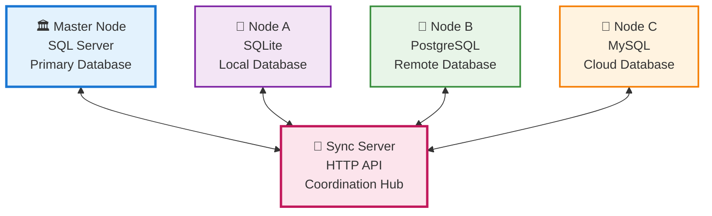
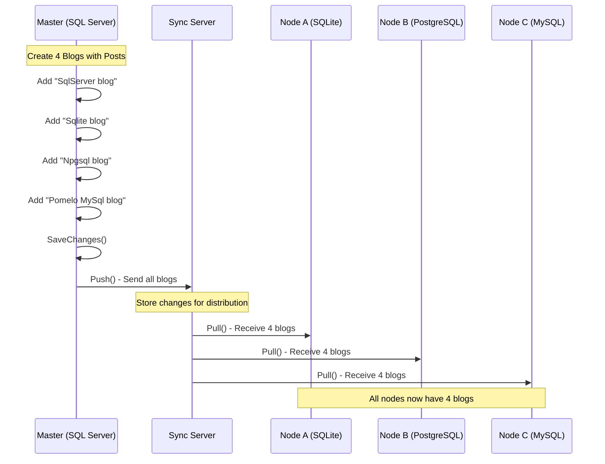
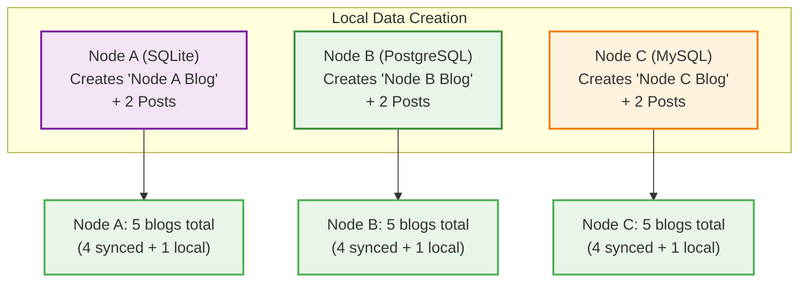
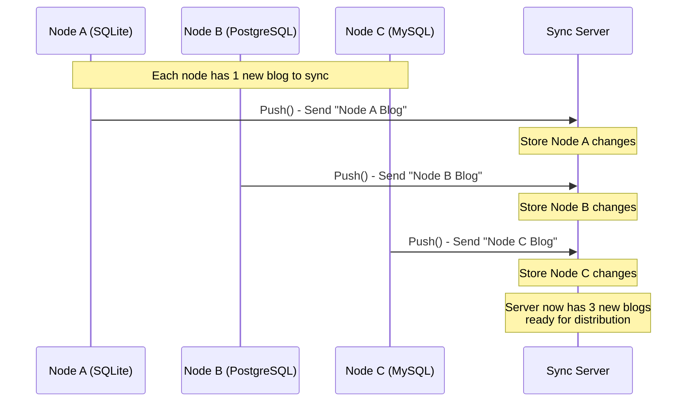
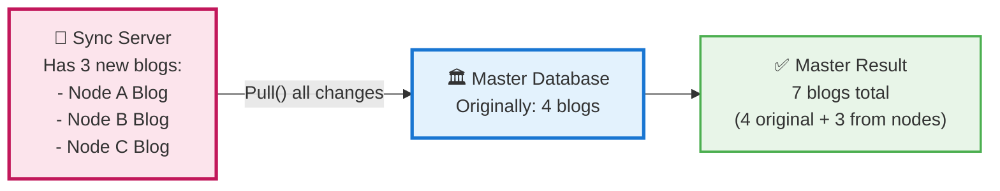
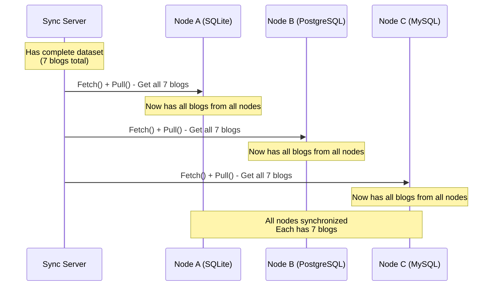
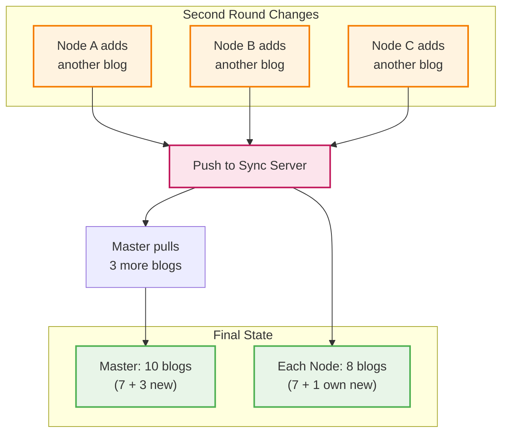

# Database Synchronization Test Flow

This document illustrates the data flow in the `AllDatabaseTests.cs` test that validates cross-database synchronization using a master-node architecture.

## System Architecture

## Step 1: Initial Data Distribution

The master creates initial data and distributes it to all nodes.

**Result**: All nodes (Master, Node A, Node B, Node C) have 4 blogs each.

## Step 2: Local Data Creation

Each node creates its own local data independently.

**Result**: Each node has 5 blogs (4 original + 1 local).

## Step 3: Push Changes to Sync Server

All nodes push their local changes to the central sync server.

**Result**: Sync server has collected 3 new blogs from the nodes.

## Step 4: Master Consolidation

The master pulls all changes from the sync server.

**Result**: Master now has 7 blogs total.

## Step 5: Complete Synchronization

All nodes fetch and pull the complete dataset from the sync server.

**Result**: All nodes are fully synchronized with 7 blogs each.

## Step 6: Second Round of Changes

The test performs a second round to verify continued synchronization.

**Final Result**: Master has 10 blogs, each node has 8 blogs.

## Summary

This test validates:

1. **Multi-database support** - SQL Server, SQLite, PostgreSQL, and MySQL
2. **Bidirectional synchronization** - Data flows both ways
3. **Conflict resolution** - Multiple nodes can make changes safely
4. **Data consistency** - All nodes eventually have consistent data
5. **Incremental sync** - Only changes are transmitted, not full datasets

The synchronization framework successfully handles complex scenarios with multiple database types and ensures data consistency across all nodes.
